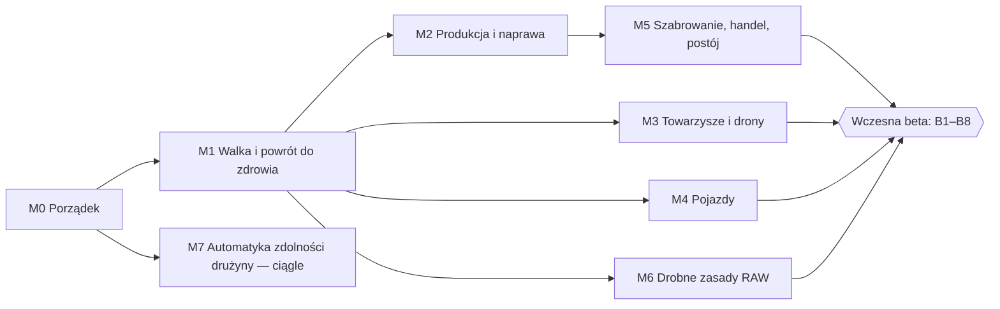

# PLAN — Droga do wczesnej bety

> Status: **AKTYWNY** (2026-09-26, moduł v0.16.0). Etap bieżący: **alfa** — późna dla walki,
> ekwipunku i przetrwania, wczesna dla produkcji, pojazdów, towarzyszy i ekonomii.
>
> Skąd ten plan: przegląd IMPLEMENTATION.md ↔ RAW z 2026-09-26. Macierz pokrycia RAW mieszka
> w [IMPLEMENTATION.md § Stan projektu](IMPLEMENTATION.md#stan-projektu) i to ona jest źródłem
> prawdy o tym, co działa. Ten plik mówi, **w jakiej kolejności** domykamy luki i **kiedy**
> możemy nazwać wydanie betą.
>
> RAW = `Neuro 5e/Podrecznik/NOE/` — konwersja PDF-a „październik” (jedyne źródło; stare zrzuty
> `source.txt` / `podrecznik.md` usunięte 2026-09-26). Odwołania `s. N` niżej to strony drukowane
> tego wydania; różnice względem marca: `Neuro 5e/Podrecznik/CHANGELOG.md`.

---

## 1. Definicja wczesnej bety — bramki

Wczesna beta to wydanie, w którym **każdy podsystem RAW jest reprezentowany** (dane + przepływ
w Foundry, choćby częściowo ręczny i jawnie opisany), modele danych przestały się przepisywać,
a moduł da się postawić na czystym świecie bez świata kampanii. Nie wymagamy pełnej automatyki
zdolności.

| # | Bramka | Jak sprawdzamy |
|---|---|---|
| B1 | **Pokrycie RAW** — w macierzy w IMPLEMENTATION.md każdy wiersz ma ✅ albo 🟡 z opisaną częścią ręczną; ❌ tylko na liście z §4 („po becie") | Przegląd macierzy |
| B2 | **Stabilne modele** — magazynki, przedmioty podręczne, Zranienie, paczki: bez przepisania przez dwie kolejne sesje, żadnej niszczącej migracji w kolejce | Changelog |
| B3 | **Paczki** — wszystkie 15 zbudowane z bieżących danych, `npm run validate:packs` zielone, po starcie Foundry rekordy identyczne z świeżym buildem (zmiany plików `.log`/`MANIFEST`/`LOG` to kompaktowanie LevelDB przy otwarciu, nie migracja) | `build:packs` przy zamkniętym Foundry, start, `build-packs.mjs --out=<tmp>` + `node dev/packs/diff-packs.mjs <tmp>` |
| B4 | **Testy** — `npm test` i pełny Quench zielone; każda mechanika z §3 ma testy warstwy 1 (czyste funkcje, `TESTING.md`) | `game.neuroshima.tests.run()` |
| B5 | **Rejestr automatyki dla zdolności klasowych** — jak dla Sztuczek i Pochodzeń; każda zdolność, Sztuczka i zdolność Pochodzenia ma plakietkę pokrycia (auto / częściowo / brak + „Nie automatyzujemy: …") | `game.neuroshima.<rejestr>.report()` |
| B6 | **Czysta instalacja** — świeży świat dnd5e 5.3, sam moduł (+ opcjonalnie Sequencer): zero błędów w konsoli przy starcie, paczki się otwierają, postać powstaje od zera przez awans (klasa → Pochodzenie → Sztuczka), walka P/KS z amunicją i Zranieniem działa | Ręczny przebieg z listą kontrolną |
| B7 | **Dokumentacja** — IMPLEMENTATION.md zgodny z kodem (tabela plików, macierz), `docs/` opisuje z perspektywy gracza każdą mechanikę widoczną na karcie | Przegląd |
| B8 | **Granica treści** — treść WKK tylko w `scripts/wkk/`, zero spoilerów fabularnych w repo | `scripts/wkk/README.md`, przegląd |

Treść WKK (Kolor Kobaltu) **nie liczy się** do bram — to nakładka stołu, nie RAW.

---

## 2. Zasady pracy (bez zmian, przypomnienie)

- **Oznaczane, nie blokowane.** Moduł podpowiada domyślne Utrudnienie / koszt akcji, MG nadpisuje.
- **Wykrycie, nie zastosowanie**, gdy RAW zostawia decyzję MG (karta z przyciskiem). Automat tylko
  tam, gdzie RAW nie zostawia wyboru.
- **Jeden magazyn stanu, N widoków, jeden lejek zapisu** (wzorzec Zranienia i magazynków).
- **NOE czy WKK?** — reguła w `scripts/wkk/README.md`, przed napisaniem pierwszej linii.
- Każda nowa reguła: czysta funkcja + test Quench warstwy 1, potem hooki.

---

## 3. Kamienie milowe

Rozmiar: **S** mały, **M** średni, **L** duży (względnie, bez szacunku czasu).
Kolejność jest priorytetem: waga mechaniczna × częstotliwość przy stole ÷ koszt.

### M0 — Porządek i zamrożenie (S)

Cel: tracker mówi prawdę, paczki są aktualne, otwarte decyzje zamknięte.

- [x] Przebudować paczki przy zamkniętym Foundry; potwierdzić brak churnu — 2026-09-26: 15/15 z danych
  NOE, po starcie świata **0 różnic w rekordach** (`dev/packs/diff-packs.mjs`); kształty v14 z buildera
  działają, zmiany plików w `git status` to tylko kompaktowanie LevelDB
- [ ] **Rejestr automatyki zdolności klasowych** — `createCoverageLedger` (`config/coverage-ledger.mjs`)
  nad `class-features-data.mjs`; pola `auto`/`manual` dopisywane w generatorze
  `dev/classes/gen_features.py`; plakietki wypiekane w paczce `zdolnosci-klasowe`. Stan dziś:
  ~13/133 z własnym kodem (Berserk, Kondycha, Goła klata, Tarcza wiary, Drugi/Trzeci atak,
  Z bara!, Cichy krok, Mój biom, Mój wróg ×2, Wściekły cios, Jak dbasz, tak masz)
- [ ] Zamknąć decyzje z `TODO_mechanika.md`: statystyki Laski, Rewolwerowiec na całą BPK (flaga
  albo wariant WKK), pojedynczy nabój do magazynka wymiennego (siatka ST — WKK)
- [ ] Pierwszy przebieg **czystej instalacji** (B6) — lista błędów staje się zadaniami tego kamienia
- [ ] Zdecydować o formie macierzy pokrycia: od teraz status zmienia się **w macierzy**, fazy 1–5
  zostają jako historia

**Gotowe gdy:** B3 i B5 spełnione, macierz zgodna z kodem.

### M1 — Walka i powrót do zdrowia wg RAW (S–M) — najwyższy priorytet

Cel: różnice RAW względem 5e, które dziś trzeba pamiętać przy każdej walce, a każdą ranę leczyć
kliknięciem w piki.

- [ ] **Neutralizacja Stopnia Zranienia** (s. 32–33, powtórzone w Postoju s. 46)
  - Regeneracja: licznik kolejnych Długich odpoczynków na aktorze (`dnd5e.restCompleted`,
    `result.longRest`); po trzecim — RO na Kondycję ST 15, sukces = −1 stopień przez `setZranienie`;
    porażka — powtórka po każdym kolejnym DO. Przerwany DO / obrażenia zerują licznik
  - Pomoc medyczna: po DO leczący z biegłością w Medycynie i narzędziami małego medyka → −1 stopień.
    Przycisk na karcie odpoczynku / w panelu Stan; rozwiązywanie leczącego jak w `toolkit-medyk.mjs`
  - Testy: licznik, reset, kolejność z auto-Wyczerpaniem Krytycznego
- [ ] **Rzuty przeciw śmierci przy obrażeniach na 0 PW** (s. 34): +1 porażka, atak wręcz +2.
  dnd5e 5.3 tego nie robi (`actor.mjs` dopisuje porażki tylko przy rzucie)
- [ ] **Olbrzymie obrażenia** (s. 34): jednorazowo ≥ 2× maks. PW → śmierć; maks. PW = 0 → śmierć.
  Wykrycie + karta dla MG (natychmiastowa śmierć przeciwników przy 0 PW — ustawienie świata, RAW
  pozwala MG ją pominąć)
- [ ] **Stabilizacja** (s. 34) — Test INT (Medycyna) ST 10 jako akcja Pomagania; stabilny bez leczenia
  odzyskuje 1 PW po 1k8 h (zegar świata, `world-clock.mjs`). Ten sam wzorzec „Pomaganie + Medycyna
  ST 10” tamuje krwawienie w Kolorach Neuroshimy (s. 201–202, zmiana z października)
- [ ] **Akcja Bieganie** (s. 21): +2× Szybkość do początku następnej tury, Utrudnienie do własnych
  Testów Ataku, ataki dystansowe przeciw biegnącemu z Utrudnieniem do końca tury; nie dla istot
  nie chodzących. AE z `duration` + `dnd5e.postBuildAttackRollConfig`
- [ ] **Domyślne Utrudnienie w dialogu ataku** (wzorzec `udzwig-attack-disadvantage.mjs`, nadpisywalne):
  atak dystansowy w zwarciu (s. 28 — wróg ≤ 1,5 m, widzi, przytomny, Szybkość > 0; wyjątki stanów),
  cel w zasięgu dalekim. dnd5e 5.3 nie egzekwuje żadnego z nich
- [ ] **`ppanc` / `przebijająca` a pancerz BG** — `armor-rules.mjs` (próg obrażeń w
  `dnd5e.calculateDamage`) i odporność kinetyczna ignorują dziś tę właściwość; sprawdzenie jest
  już w `combat/bestiary-thresholds.mjs`. Także z amunicji (`effectiveDamageFor().props`).
  Zamyka `PLAN_weapon_properties.md` §3.2
- [ ] **Zagrożenia bez wyzwalacza** (źródła Wyczerpania istnieją, nic ich nie nakłada):
  Sen (s. 45 — doba bez snu → RO KON ST 20), Uduszenie (s. 259 — 1 + mod. KON minut, potem
  Wyczerpanie co turę, zdejmowane po złapaniu oddechu), Przemarznięcie (s. 258 — RO KON ST 5 + 1/°C
  poniżej zera co godzinę, zdejmowane DO w cieple). Przyciski MG, jak Skażenie

**Gotowe gdy:** każda pozycja ma test warstwy 1 i weryfikację na żywo; wiersze Walka i Postój
w macierzy bez ❌.

### M2 — Produkcja i naprawa (L)

Cel: panel Surowców przestaje być samą księgowością. Tożsamość klasy Spec (Chemik, Medyk, Monter)
i Sztuczek Fabrykator / Złomiarz / Przydasie stoi na tym rozdziale. RAW: s. 144–146.

- [ ] **Czyste zasady** (`config/production-rules.mjs` + testy): surowce = ⌊cena/2⌋ w gb, podział
  na typy proponowany, edytowalny przez MG; czas = cena (w górę) × 0,5 h dla jednorazowych, × 1 h
  dla wielorazowych; maks. 10 h pracy na dobę; ST wg wartości (≤10: 5, ≤25: 10, ≤50: 15, ≤75: 20,
  ≤100: 25, więcej: 30); pomocnik — Test narzędzi ST 10, sukces = Ułatwienie; porażka = od nowa
  z tymi samymi surowcami
- [ ] **Projekt produkcji na aktorze** (flaga, jeden magazyn): przedmiot, zarezerwowane surowce
  (schodzą z `surowce-inventory.mjs`), przepracowane godziny; „przepracuj N h" przez zegar świata;
  Test ostatniego dnia; wynik = przedmiot z paczki / katalogu
- [ ] **Wymagania**: biegłość w narzędziach + zestaw w ekwipunku (logika `tool-availability.mjs`),
  schemat dla przedmiotów > 10 gb
- [ ] **Schematy jako dane** (`config/schematy-data.mjs`): pirotechniczne (s. 80), rusznikarskie
  (s. 81), farmaceutyczne (s. 82), hakerskie (s. 83), elaboracja amunicji (s. 136). Znane schematy
  na aktorze; Spec 3. poziomu dostaje je z wyboru profesji
- [ ] **Szybka produkcja** (zdolność Speca): raz na odpoczynek ≤ 25 gb (50 gb od 11. poz.),
  1 min × 1 gb
- [ ] **Naprawa** — generyczna akcja na przedmiocie: Drobnostka / Trochę roboty / Skomplikowana
  harówa → ST 10/15/20, koszt 10/30/50 % ceny w surowcach, czas 1k4 min / 1k4 h / 2k4 h.
  Podpiąć istniejące: uszkodzenie broni palnej (`jams.mjs`), degradacja białej (`toolkit-kowal.mjs`),
  łatanie pancerza
- [ ] `gear-data.mjs`: zaślepki `craftingPlaceholder` stają się prawdziwym wyjściem produkcji

**Gotowe gdy:** postać ze schematem planuje, przepracowuje i kończy przedmiot, surowce schodzą
z panelu, naprawa broni i pancerza idzie jedną ścieżką.

### M3 — Towarzysze i drony (M)

Cel: profesje, których rdzeniem jest druga postać na mapie. Dotyczy m.in. Partnera Victora (Sędzia).

- [ ] **Aktor-towarzysz** powiązany z właścicielem (`flags.<mod>.companion.ownerId`). Statystyki
  pochodne od właściciela (PB, mod. MDR, poziom klasy — np. Psi partner: TT 12 + PB, PW 10 + 10 ×
  mod. MDR, KW k6 × poziom Zwiadowcy) liczy moduł i synchronizuje po `updateActor` właściciela —
  dnd5e nie umie formuł z cudzego aktora
- [ ] **Szablony w nowej paczce `towarzysze`**: Psi partner (s. 100), Ludzki partner (s. 101 —
  szkielet do dokończenia przez gracza), Zmutowany owad / ssak / gad (Oswajanie zwierząt, s. 99),
  Dron kroczący i latający (s. 83), Prawa ręka Mafiozo (s. 76 — szablon postaci)
- [ ] Tura towarzysza zawsze po turze właściciela (porządek w Combat), „bez komendy → Unikanie"
  jako notka
- [ ] Śmierć jak BG: Stopnie Zranienia i rzuty przeciw śmierci na NPC-towarzyszu (`zranienie.mjs`)
- [ ] Wyżywienie towarzyszy w dziennym zapotrzebowaniu drużyny (`party-supplies.mjs`)
- [ ] Emiter EMP (Zabójca maszyn, s. 101) — karta z RO i efektem na maszynach

**Gotowe gdy:** towarzysz stoi na scenie, rośnie z awansem właściciela, ginie według zasad BG.

### M4 — Pojazdy: domknięcie rozdziału (M–L)

Cel: pościg od startu do mety bez notatek MG. Projekt: `PLAN_poscigi.md` §10.

- [ ] Tabela Awarii pojazdów k20 (s. 265) + wyzwalacz (krytyk albo ≥ Próg awarii) — wzorzec
  `MACHINE_FAILURES` z `bestiary-thresholds.mjs`
- [ ] Komplikacje pościgu k20 (s. 267) i ST pościgu na planszy
- [ ] Paleta manewrów kierowcy (s. 268) z ruchem potwierdzanym kliknięciem (decyzja D4)
- [ ] Karta pojazdu: TT, Próg obrażeń, Próg awarii, paliwo, załoga; próg obrażeń pojazdu
  w potoku obrażeń. Spalanie ze statblocków (s. 262–264: autobus 40, motocykl 5, osobówka
  10 l/100 km — dopisane w październikowym wydaniu) jako pole w `vehicles-data.mjs` (dziś tylko
  w `uwagi`) i domyślny bak w `party-travel.mjs` zamiast `PALIWO_DOMYSLNE`
- [ ] Wsiadanie, kierowanie, wypadanie, trudny teren a Szybkość — testy RAW jako akcje na karcie
- [ ] Atakowanie z pojazdu — podpowiedzi w dialogu ataku (osłona pasażera, Utrudnienie)

**Gotowe gdy:** wiersz Pojazdy i pościgi w macierzy = ✅/🟡.

### M5 — Szabrowanie, bebeszenie, handel, postój (M)

Cel: dzień w mieście i wyprawa po ruinach mają narzędzia w Foundry. Zależy od M2 (surowce muszą
mieć odbiorcę).

- [ ] **Szabrowanie ruin** (s. 270–271): rodzaj ruin → czas, szansa komplikacji k100, surowce;
  Tabela komplikacji k10 (s. 270, spotkania z Bestiariusza); wykrywacz metalu = Ułatwienie.
  RollTables w paczce + dialog MG; wynik trafia do panelu Surowców
- [ ] **Bebeszenie** bestii (rozmiar → czas, ST, materiały organiczne, mięso) i maszyn Molocha
  (CE/CZ/MK) (s. 269) — przycisk na martwym żetonie, kategoria z `creature-types.mjs`
- [ ] **Gambling** (s. 43–44): modyfikatory dostępności lokalizacji, ceny regionalne, test
  dostępności. Przenieść logikę `Integracje/loot_generator.py` do okna handlarza albo przynajmniej
  do tabel w paczce
- [ ] **Aktywności postoju** na karcie drużyny (s. 46–47): Rozrywka (10 h + 50 gb → Fuks na
  7 dni), Plotkowanie (5 gb + Test CHA (Śledztwo) ST 10, +1 informacja za każde 5), Hazard (ST 20,
  wygrana ×2 / utrata stawki); Długi postój: Praca, Trening/Nauka, Budowa bazy, Koszt utrzymania
  (także towarzyszy)

**Gotowe gdy:** wiersze Eksploracja (gambling), Postój i Teczka MG (szabrowanie) bez ❌.

### M6 — Drobne zasady RAW (S każda)

- [ ] **Niszczenie obiektów** (s. 253): tabele TT (materiał) i PW (rozmiar × kruchość); szablon aktora
  „Obiekt" (niewrażliwy na truciznę i psychiczne, automatyczna porażka RO); `burząca` ×2
  i `karczująca` automatycznie na takim celu — zamyka `PLAN_weapon_properties.md` §5
- [ ] **Broń improwizowana** (s. 253) jako reguła ogólna: 1k4, bez PB, rzut 3/9 m — przełącznik
  w dialogu ataku / szablon przedmiotu (dziś jedyny przykład to Pochodnia)
- [ ] Właściwości broni: `dluga`, `ciezka`, `jednorazowa` (blokada przeładowania) —
  `PLAN_weapon_properties.md` §3.3
- [ ] Latanie: Nieprzytomność lub Szybkość 0 → upadek (`falling.mjs`); Powalenie → opadnięcie bez obrażeń
- [ ] Walka na wierzchowcu (s. 257), pływanie, skakanie — karta referencyjna / akcje z ST, bez
  głębszej automatyki

### M7 — Automatyka zdolności posiadanych przez drużynę (ciągłe)

- [ ] Z rejestru z M0: lista zdolności, Sztuczek i zdolności Pochodzeń na kartach aktywnych BG,
  posortowana według częstotliwości użycia przy stole — automatyzujemy od góry
- [ ] Rodzina „raz na rundę, N kości" na `class-resource-dice.mjs`: Bolesny atak, Słaby punkt,
  Mutant na śniadanie, Maszyna do zabijania, Mój bóg kule nosi — każda z własnym warunkiem spustu
- [ ] Bramka bety to **plakietka pokrycia na każdej zdolności** (B5), nie pełna automatyka

---

## 4. Świadomie po becie

| Pozycja | Dlaczego później |
|---|---|
| Kolory Neuroshimy (Rdza, Rtęć, Stal, Chrom — s. 201) jako profile świata | Opcjonalne w RAW; framework powinien uogólnić przełącznik WKK, co jest osobnym projektem. Brać wersję z października: krwawienie tamuje Pomaganie + INT (Medycyna) ST 10 |
| Pełna automatyka 133 zdolności klasowych, 53 Sztuczek, 36 zdolności Pochodzeń, 260 zdolności Bestiariusza | Długi ogon; beta wymaga tylko plakietek (B5) |
| Wytrzymałość pancerzy (opcjonalne RAW) | Decyzja: ręcznie (`[—]` w trackerze) |
| Docelowe żetony Bestiariusza (25/51), kalibracja skali, pozostałe ikony | Grafika, nie mechanika |
| Screen shake DS/MS, iskry i krew trafienia | Oprawa |
| Zorganizowane grupy, Front | Treść świata, brak mechaniki |
| Tłumaczenie EN | Brak oficjalnego wydania EN |

---

## 5. Ryzyka

- **RAW sam jest w alfie** — sprzeczności (zasięg granatu), literówki; wydanie „październik”
  uzupełniło „str. XXX”. Każde rozstrzygnięcie RAI trafia do tabeli RAI w `scripts/wkk/README.md`,
  a przy nowym PDF-ie: `Podrecznik/tools/pdf2md.py` + `diff_editions.py` dają listę zmian.
- **Aktualizacje dnd5e / FVTT** — na betę przypiąć wersje (`verified` w `module.json`),
  a pułapki v14 dopisywać do `ARCHITECTURE.md` §11.
- **Paczki LevelDB** — `build:packs` tylko przy zamkniętym Foundry (serwer trzyma blokady, gdy świat
  jest uruchomiony — także na ekranie `/join`); po budowie sprawdzić, że
  `packs/<nazwa>/` ma niepusty `.log` albo `.ldb` (patrz `.gitignore`).
- **Rozrost zakresu przez WKK** — nowe pomysły stołu idą do `scripts/wkk/` i nie blokują bram.
