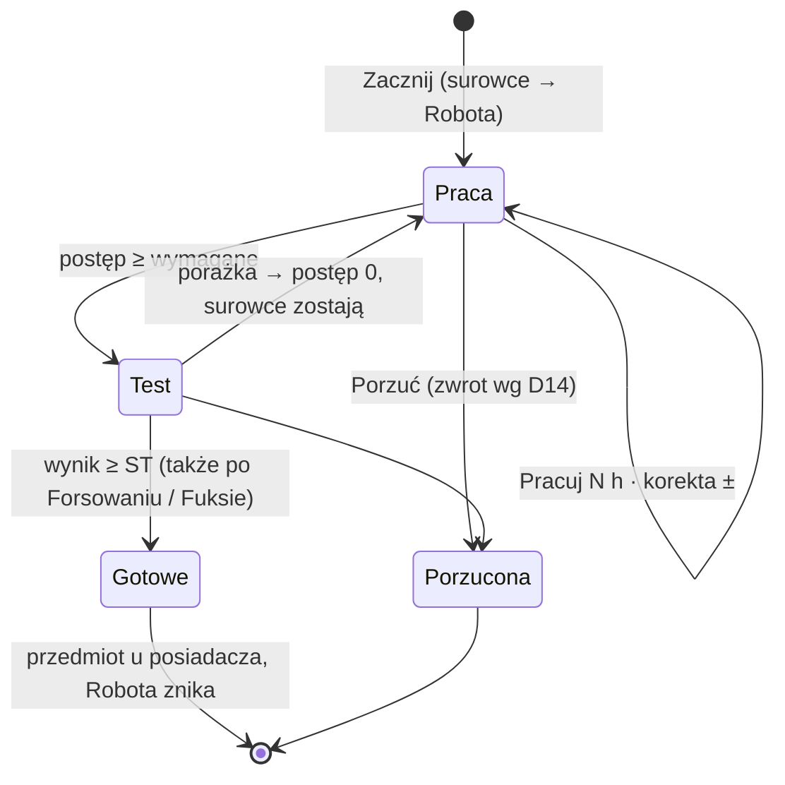

# PLAN — Produkcja: Roboty, Schematy, Wprawa, Naprawa

> Status: **PROJEKT** (2026-09-27, moduł v0.16.x). Rozwinięcie kamienia **M2** z
> [PLAN_beta.md](PLAN_beta.md), brane **poza kolejnością** (decyzja MG). Wiersz macierzy:
> „Produkcja przedmiotów” w [IMPLEMENTATION.md § Stan projektu](IMPLEMENTATION.md#stan-projektu) — dziś ❌.
>
> RAW (NOE, wydanie październikowe): Produkcja przedmiotów **s. 144–146**; Postój **s. 45–47**;
> Spec — Szybka produkcja **s. 79**, profesje i ich tabele schematów **s. 80–84**; narzędzia
> **s. 134–136** (w tym elaboracja amunicji s. 136); Fabrykator **s. 103**, Przydasie **s. 106**;
> Truciciel **s. 94**; Pogromca **s. 99**; Pochodzenia: Nano-Tech **s. 60**, „Jeśli ma silnik, to
> ruszy” **s. 61**; Wytrzymałość pancerzy (opcjonalna) **s. 115**; naprawa fachowa pojazdu **s. 264**.
>
> Repo jest publiczne: żadnych cytatów z podręcznika — liczby, parafrazy, numery stron.

---

## 0. Słownik

| Termin | Znaczenie | Gdzie żyje |
|---|---|---|
| **Przepis** | Jedna rzecz do zrobienia: wynik, ST, czas, surowce, narzędzia. **Nie zależy od źródła dostępu.** | `config/recipes-data.mjs` |
| **Schemat** | Fizyczny przedmiot otwierający dostęp do jednego przepisu. Kupowany, sprzedawany, łupiony. | Ekwipunek (typ `loot`) |
| **Wprawa** | Ten sam dostęp co Schemat, ale wrodzony — nie do sprzedania ani oddania. | zdolności + flaga aktora |
| **Proste** | Przedmioty, które nie wymagają schematu (≤ 10 gb, s. 146) — wystarczy biegłość w narzędziach. | pochodne |
| **ZP — Zdolność produkcyjna** | Schematy ∪ Wprawa ∪ Proste. Nazwa w kodzie; w UI sekcja „Co umiesz zrobić”. | liczona |
| **Robota** | Trwający wątek produkcji albo naprawy. Fizyczny przedmiot, w którym siedzą zamrożone surowce. | Item u tego, kto go trzyma |
| **Na warsztacie** | Sekcja Robót w toku (idiom „mieć coś na warsztacie”). | zakładka Produkcja |
| **Miejsce** | Aktor-kontener na Roboty, których nikt nie nosi: warsztat, baza. | aktor typu `vehicle` z flagą |
| **Pula** | Wspólne zasoby, **z których się przenosi**, nie produkuje: pojazd drużyny, pojazdy-członkowie, Miejsca. | liczona |

**Kluczowa zasada: przepis ≠ źródło.** ST, czas i surowce należą do przepisu. Schemat, Wprawa
i Proste tylko otwierają drzwi. Każdy przedmiot ma **przepis standardowy** (wzór z s. 144–146);
tabele profesji Speca to **przepisy profesji** — dodatkowe i tylko dla tej profesji (D22). Kupiony
schemat długiego karabinu daje więc przepis standardowy (ST 30 z wartości), a Rusznikarstwo dokłada
swój (ST 25, s. 81). Z WKK profesja nie dokłada osobnego przepisu — przyspiesza wykonawcę
i łagodzi ST (D26, §5.1c).

---

## 1. Zasady projektowe

1. **Osobna zakładka „Produkcja”** na karcie BG (po Zasobach). Ma ją każdy; Brutal po prostu jej nie
   otwiera, Spec w niej mieszka. Plakietka z liczbą Robót na zakładce. Pusty stan mówi wprost:
   „Nie masz tu nic do roboty. Schematy z plecaka możesz sprzedać.”
2. **Fizyczne rzeczy w fizycznych miejscach.** Schematy w Ekwipunku, Roboty jako przedmioty
   u tego, kto je trzyma, surowce zamrożone w Robocie. Wagę liczy natywny udźwig dnd5e — zero
   osobnego systemu; traktora na plecach nie uniesiesz, bo Unieruchomienie.
3. **Produkuje się z własnego ekwipunku** (albo z kontenera, w którym stoi Robota). Pula to źródło
   przenoszenia — moduł mówi „masz to w Ciężarówce” i oferuje przeniesienie.
4. **Jawność.** Każda zmiana Roboty to wiadomość na czacie. Produkcja prywatna nie jest
   obsługiwana — tajne rzeczy MG prowadzi z graczem ręcznie.
5. **Oznaczane, nie blokowane** ([PLAN_beta.md §2](PLAN_beta.md)): brak zestawu, odległość od
   pojazdu, limit 10 h/dobę, zmieniony podział surowców — ostrzeżenie i plakietka. Twarda blokada
   tylko tam, gdzie obejście tworzy przedmioty z niczego (brak surowców).
6. **Jeden lejek zapisu.** Każda zmiana Roboty idzie przez `production/robota.mjs`
   (`start/work/adjust/test/abort/finish`). Zakładka, okno odpoczynku i API wołają te same funkcje.
7. **NOE czy WKK** — rozstrzygnięte per reguła w §3 i §4, przed pierwszą linią kodu.

---

## 2. RAW w pigułce

- **Wymagania:** biegłość w narzędziach potrzebnych do przedmiotu (pomocnik też), surowce, czas.
- **Surowce:** wartość ⌊cena / 2⌋ gb; podział na typy „logiczny i uproszczony”, ostatecznie MG.
  Przelicznik wagi: CH / CZ / CE — 1 gb za 100 g; MK / MO — 1 gb za 1 kg.
- **Czas:** wielorazowe cena × 1 h, jednorazowe cena × 0,5 h (nieparzysta cena w górę).
  Maks. **10 h pracy na dobę**. Wolno z przerwami.
- **Test ostatniego dnia**, ST wg wartości: ≤ 10 → 5 · ≤ 25 → 10 · ≤ 50 → 15 · ≤ 75 → 20 ·
  ≤ 100 → 25 · więcej → 30. Pomocnik: Test ST 10 → Ułatwienie. **Porażka: od nowa, surowce zostają.**
- **Schematy:** potrzebne powyżej 10 gb; cena = cena przedmiotu, dostępność o połowę mniejsza.
  Spec 3. poziomu dostaje schematy z profesji za darmo.
- **Tabele profesji (s. 80–84) i elaboracji (s. 136):** własne ST / czas / surowce, także
  alternatywy (`CH/MO`, `MK/MO`). Stoją obok wzoru, nie zamiast (D22). Rusznikarstwo zawiera wiersze-kategorie
  („broń palna krótka: ST 15, cena × 1 h, CZ + MK = 50%”).
- **Postój:** KO — produkcja, naprawa, czyszczenie broni i gambling łącznie ≤ 1 h; dłużej przerywa
  KO. DO — produkcja dozwolona.
- **Szybka produkcja (Spec 3):** raz na KO/DO, poza zwykłymi zasadami, wartość ≤ 25 gb (50 gb od
  11. poz.), 1 min × 1 gb, wymaga narzędzi, surowców i schematów.
- **Fabrykator:** produkcja o 50% szybciej. **Przydasie:** surowce −50%, czas bez zmian.
- **Pochodzenia:** Ułatwienie przy konstruowaniu/naprawie elektroniki (Nano-Tech) i pojazdów
  mechanicznych („Jeśli ma silnik, to ruszy”).
- **Nietypowe źródła:** Pogromca (100 gb surowców + 100 h; naboje PB sztuk na DO po 10 gb),
  Truciciel (1 porcja trucizny na DO z narzędziami chemika).
- **Naprawa:** Drobnostka / Trochę roboty / Skomplikowana harówa → ST 10 / 15 / 20, koszt 10 / 30 /
  50% ceny, czas 1k4 min / 1k4 h / 2k4 h. MG decyduje, co i czym.
- **Pancerz (opcjonalne):** krytyk → TT −1; naprawa MK = 10% ceny × utracona TT, 1 / 5 / 10 h na
  punkt (lekki / średni / ciężki), narzędzia krawca albo kowala.

---

## 3. Decyzje (MG, 2026-09-27/28)

| # | Temat | Decyzja | Kosz |
|---|---|---|---|
| D1 | Nazwy | **Wprawa**, **Robota**, sekcja **Na warsztacie**, ZP w kodzie | — |
| D2 | Porażka Testu | **RAW**: od nowa, surowce zostają. Forsowanie i Fuks działają na ten Test normalnie | NOE |
| D3 | Fabrykator | **czas × 0,5** — „o 50% szybciej” czytane równolegle do Przydasie | NOE (odczyt) |
| D4 | Waga Roboty | interpolacja: waga surowców → waga wyniku, proporcjonalnie do postępu | WKK |
| D5 | Na osobie / na miejscu | Robota = przedmiot; miejsce = aktor, który go trzyma (postać / pojazd / Miejsce) | NOE (infrastruktura) |
| D6 | Pula | `primaryVehicle` drużyny + pojazdy będące członkami drużyny + Miejsca. Plecaki innych BG — nie | NOE |
| D7 | Odległość przy przenoszeniu | tylko ostrzeżenie | — |
| D8 | Test końcowy | zostaje; przekroczenie 100% samo otwiera Test; sukces sam tworzy przedmiot | NOE |
| D9 | Pomocnicy | **poza systemem**: MG rzuca osobno, wynik wpisuje korektą postępu („a za Jima dodaj sobie 10%”). Ułatwienie z Testu pomocnika = przycisk Ułatwienia w oknie rzutu. Rozbudowa — później | NOE (RAW: decyduje MG) |
| D10 | Szybka produkcja | osobny mechanizm, **wyraźnie inny mechanicznie i wizualnie**; także poza odpoczynkami (np. 10-minutowe tury eksploracji); bez Testu | NOE |
| D11 | Naprawa | cała w tym planie | NOE |
| D12 | Skąd Schematy | wygenerowana paczka `schematy` + przycisk MG „Utwórz schemat” na dowolnym przedmiocie | NOE |
| D13 | Wprawa od MG | dowolna, jako luźna nagroda fabularna, z notatką („noc przy wódce z akwizytorem kotłów → termostat”). RAW to przewiduje: inne przedmioty „po konsultacji z MG” (s. 134) | NOE |
| D14 | Porzucenie | postęp ≤ 10% → zwrot 100% surowców; powyżej → 50%. **Porzucanie w całości jest WKK** — RAW go nie przewiduje, więc bez WKK przycisku nie ma | WKK |
| D15 | Waga i rozmiar Schematu | 1 g na godzinę produkcji przepisu (traktor 1000 h → 1 kg); bez WKK 0 kg (niezdefiniowane). Trzy rozmiary z ikonami wg godzin: Notatka ≤ 40 h, Instrukcja ≤ 250 h, Dokumentacja > 250 h | WKK (waga) / NOE (ikony) |
| D16 | Narzędzia a schematy | Każdy przepis ma **wymóg narzędzi** (może być pusty; zwykle 0–1 narzędzie, czasem więcej, także z „lub”) — obowiązkowy; RAW nie zna obejścia, chyba że tekst wprost na nie pozwala (s. 134: bez odpowiednich narzędzi nie wykonasz skomplikowanych czynności). Moduł braki oznacza i pozwala je przeklikać (D23). **Narzędzia nie dają schematów**: lista „Produkcja” narzędzia mówi, *czym* się robi, nie że *umiesz*. Próg 10 gb obowiązuje zawsze. Wymóg to **wyrażenie I / LUB z nawiasami** (§5.1a) — bełty: kowal LUB stolarz | NOE |
| D17 | Naprawa wyszczerbionej broni białej | stopień wg liczby uszkodzeń (kroków kości od oryginału): 1 → Drobnostka (ST 10), 2 → Trochę roboty (ST 15), 3+ → Skomplikowana harówa (ST 20, maks.). Cały wiersz tabeli — koszt i czas razem z ST | NOE |
| D18 | Wytrzymałość pancerzy | ustawienie świata, domyślnie **wył.**; w świecie kampanii **wł.** RAW nie wiąże jej z Kolorami (Rdza i Rtęć podnoszą tylko Awaryjność broni, s. 201–202) — domyślne wł. dla Rdzy / Rtęci to ewentualny preset WKK, gdy powstaną profile Kolorów (PLAN_beta §4) | NOE (+ WKK preset) |
| D19 | Przejęcie Roboty | jak każde przeniesienie przedmiotu. Robota na innej postaci → nowy kierownik; na pojeździe / w Miejscu → kierownik bez zmian. Gracz → gracz niewymagane (nie zabronione), ale zawsze możliwe przez MG | NOE (infrastruktura) |
| D20 | Uprawnienia | konwencja dnd5e (§8.1): gracze są Właścicielami aktora drużyny, jej pojazdów i Miejsc — tak jest dziś w świecie. Nowe Miejsce kopiuje uprawnienia z głównej drużyny | — |
| D21 | Klonowanie Roboty | **twardy zakaz** — zawsze dokładnie jeden egzemplarz; jedyna droga to przeniesienie (§8.1) | NOE (infrastruktura) |
| D22 | Przepisy profesji | Tabele Speca (s. 80–84) działają **tylko dla tej profesji** i stoją **obok** przepisu standardowego, nie zamiast. Wymóg narzędzi = narzędzia profesji **&** zwykły wymóg przedmiotu (Koktajl Mołotowa z Pirotechniki: chemika & rusznikarza, 1 minuta; standardowy: chemika, 5 h). Surowce z tabeli to też domyślny podział przepisu standardowego tego przedmiotu (MG może zmienić). Przepis profesji ma być ulepszeniem (szybszy / tańszy / łatwiejszy) — gorszy jest podejrzany i trafia do audytu (§5.1b) | RAI (2026-09-27) |
| D23 | Braki narzędzi | **oznaczane, nie blokowane**: brak zestawu albo biegłości → przepis w grupie ⛔, ale z przyciskiem „Zacznij mimo braków”. Robota nosi plakietkę ⚠ z listą braków, karta startu jest głośna i ma przyciski MG *Zatwierdź* (zdejmuje plakietkę) i *Zmień ST*; Test końcowy powtarza ostrzeżenie. Nie da się przeklikać: braku dostępu (Schemat / Wprawa — to nadaje MG) i braku surowców | NOE |
| D24 | Wprawa z profesji | RAW łączy fizyczny schemat z wiedzą („otrzymujesz schematy”); tu to **Wprawa**: profesja daje przepisy standardowe wszystkich przedmiotów ze swojej tabeli **i** ich przepisy profesji. Żaden fizyczny Schemat nie powstaje — zdolność nie może tworzyć łupu | NOE (odczyt) |
| D25 | Waga Roboty bez WKK | waga surowców, które weszły do Roboty, przez cały czas; po ukończeniu przedmiot waży swoje. Nic nie znika ani nie powstaje — bez worka bez dna | NOE (brak wartości RAW, decyzja MG) |
| D26 | Przepisy profesji z WKK | przepis standardowy z tymi samymi surowcami (**bez rabatu** — Przydasie działa jak zawsze), krótszym czasem (D27) i ST bez stopnia 30: powyżej 75 gb zawsze 25 (wariant C — czysty „tylko czas” dawałby pojazdom Mechaniki ST 30). Z WKK profesja nie jest osobnym przepisem, tylko cechą wykonawcy, jak Fabrykator: liczona przy każdej pracy i przy Teście. Tabela daje już tylko listę przedmiotów, podział surowców i zestaw narzędzi profesji. Bez WKK — D22 bez zmian | WKK |
| D27 | Czas profesji z WKK | ×0,75 domyślnie; ×0,5 z pełnym zestawem narzędzi profesji pod ręką (D32) | WKK |
| D28 | Podłoga mnożników | iloczyn wszystkich mnożników czasu nie schodzi poniżej ×0,25 (profesja ×0,5 · Fabrykator ×0,5 = dokładnie 0,25) | WKK |
| D29 | Czas w minutach | czas standardowy ze wzoru RAW (z zaokrągleniem nieparzystej ceny), mnożniki na minutach, w dół do pełnej minuty, **minimum 1 minuta**, wyświetlanie GG:MM. Postęp Roboty i budżety odpoczynku (KO 60 min, DO 600 min) też w minutach | NOE (infrastruktura) |
| D30 | Mołotow „1 minuta” | błąd tabeli, nie wyjątek — jedyny wiersz, którego czasu nie daje wzór przy żadnej cenie, a tekst nie ogłasza go wyjątkiem (por. „Wyjątki są ważniejsze od zasad ogólnych”, s. 23). Bez WKK wiersz zostaje dosłownie (D22); z WKK obowiązuje D26 | WKK |
| D31 | Literówki w tabelach | Wózek: 9 MK zamiast 19 MK; Celownik optyczny: 40 h zamiast 20 h. Przyjęte w obu trybach (errata) | NOE (errata MG) |
| D32 | Co daje ×0,5 | **pełny zestaw narzędzi profesji pod ręką** (postać albo kontener Roboty), obok zwykłego wymogu przedmiotu. Gdy zwykły wymóg już obejmuje cały zestaw — ×0,5 zawsze; gdy nie — brakujące narzędzie profesji jest opcjonalnym przyspieszeniem. Zestaw nigdy nie jest wymagany. Przykłady: §5.1c | WKK |

---

## 4. Dziury w RAW i co z nimi robimy

| # | Luka | Rozwiązanie | Kosz |
|---|---|---|---|
| L1 | Tabele profesji mają inne ST / czas / surowce niż wzór (osobówka 1000 gb: ST 20 w tabeli, 30 z wartości) | tabela = przepis profesji obok standardowego (D22); Schemat daje przepis standardowy | RAI |
| L2 | Lista „Produkcja” narzędzia zawiera rzeczy > 10 gb (latarka, wózek) — czy znosi wymóg schematu? | nie — D16 | NOE |
| L3 | Wartość za sztukę czy za partię (9 mm: 2 gb/szt., partia 10 szt.) | Próg schematu — od ceny **jednej sztuki** (9 mm nie wymaga schematu). ST z wartości — od wartości **całej partii**, tak jak liczy tabela elaboracji (10 × 9 mm ≈ 20 gb → ST 10, s. 136). Elaboracja to tabela narzędzia, nie profesji — dla każdego biegłego w narzędziach rusznikarza | NOE (odczyt) |
| L4 | Rusznikarstwo, broń ciężka: „koszt × 2 godz.” | koszt = cena | NOE (odczyt) |
| L5 | Kilka narzędzi w przepisie, jeden „Test używanych narzędzi” | gracz wybiera jedno z narzędzi, którymi spełnił wyrażenie (§5.1a); domyślnie to z najwyższą premią | NOE (odczyt) |
| L6 | Brak zasad porzucenia | porzucanie w całości WKK (D14); bez WKK nie istnieje | WKK |
| L7 | Brak wagi Robót i Schematów | WKK: D4, D15. Bez WKK: Schemat 0 kg (D15); Robota — waga surowców wejściowych (D25) | WKK |
| L8 | Doba = ? (limit 10 h) | `dayCounter` z `actors/health-panel.mjs`; licznik minut realnej pracy na aktorze (nie postępu); przekroczenie = ostrzeżenie | NOE |
| L9 | KO: 1 h zajęć łącznie, dłużej przerywa KO | wspólny budżet 1 h w oknie KO (produkcja + naprawa + czyszczenie broni); przekroczenie = czerwone „KO przerwany — bez korzyści”, bez blokady | NOE |
| L10 | Szybka produkcja: Test? Przydasie/Fabrykator? | bez Testu (D10); Przydasie tnie surowce, Fabrykator minuty | NOE (odczyt) |
| L11 | Podział surowców „decyduje MG” | domyślne profile podziału per kategoria, edytowalne przy starcie; czat oznacza „zmieniony podział”, MG może zawetować | NOE |
| L12 | Alternatywy `CH/MO` w tabelach | alokacja automatyczna (najpierw typ, którego masz więcej), edytowalna przy starcie | NOE |
| L13 | Schemat zniknął w trakcie Roboty (sprzedany, zgubiony) | praca dalej możliwa z ostrzeżeniem „brak dostępu” — MG rozstrzyga | NOE |
| L14 | dnd5e **domyślnie kopiuje** przedmiot przeciągany między aktorami (§8.1) — kopia Roboty to podwojone zamrożone surowce | unikalny `robota.id` + strażnik: kopia zamienia się w przeniesienie, a gdy nie może — prośba do MG; audyt duplikatów dla MG | NOE (infrastruktura) |
| L15 | Porażka naprawy — RAW milczy | jak przy produkcji: czas przepada, surowce zostają | NOE (odczyt) |
| L16 | Dzisiejsze naprawy broni (`weapons/jams.mjs`, `weapons/melee-degradation.mjs`) to sam Test — bez kosztu i czasu; naprawa broni białej jako „Akcja” sprzeczna z RAW (min. 1k4 min) | przepięte na tabelę naprawy w E7 | NOE |
| L17 | Wytrzymałość pancerzy jest opcjonalna; PLAN_beta §4 mówi „ręcznie” | ustawienie świata — D18 | NOE |
| L18 | Kolory zmieniają ceny (Rdza: wszystko ×2) — czy produkcja też drożnieje? | nie: wzór, próg schematu i ST liczą z ceny **podręcznikowej** (s. 144–146). Kolor zmienia tylko ceny rynkowe, także schematów | NOE (odczyt) |

---

## 5. Model danych

### 5.1 Przepis (`config/recipes-data.mjs`, czyste dane + generator)

```js
{
  id: "pirotechnika.granat-odlamkowy",          // stabilny klucz
  wynik: { typ: "item", ref: "amunicja:grenade-frag", ilosc: 1 },  // item | aktor | ulepszenie | usluga
  jednorazowy: true,
  cena: 70,                                     // gb za sztukę: próg schematu, ST (gdy brak tabeli)
  st: 20, minuty: 2100,                         // 35 h; z tabeli albo ze wzoru (D29)
  surowce: [{ typy: ["CH"], gb: 30 }, { typy: ["CZ"], gb: 4 }, { typy: ["MK"], gb: 1 }],
  narzedzia: "chemika & rusznikarza",          // wyrażenie §5.1a; "" = bez narzędzi
  tagi: ["pirotechnika"],                       // "elektronika", "pojazd-mechaniczny" → Ułatwienia z Pochodzeń
  zrodlo: { tabela: "pirotechnika", s: 80 }     // albo { wzor: true }
}
```

Trzy źródła przepisów:

1. **Tabele profesji** — Pirotechnika, Rusznikarstwo, Farmacja, Mechanika, Hakerstwo, Serwisowanie.
   Bez WKK to przepisy profesji (D22): liczby przepisane ręcznie z poprawkami D31, wiersze-kategorie
   Rusznikarstwa rozwijane na bronie z `weapons-data.mjs`, wymóg narzędzi
   `(zestaw profesji) & (zwykły wymóg przedmiotu)`. Z WKK tabela daje już tylko listę przedmiotów,
   podział surowców i zestaw profesji (D26). Tabela elaboracji (s. 136) należy do narzędzia, nie
   profesji — jej przepisy ma każdy biegły w narzędziach rusznikarza. Pogromca i Truciciel to
   zdolności z własnymi regułami, nie tabele (**P14**).
2. **Generator z katalogów** — `weapons-data`, `armor-data`, `gear-data`, `chemia-data`, `ammo-data`,
   `addons-data`, `prowiant-data`, `toolkits-data`, `magazines-data`, `vehicles-data` → wzór +
   **jawna lista narzędzi per wpis** (domyślna z kategorii, z list „Produkcja” narzędzi,
   s. 134–136, nadpisywalna per wpis) + **profil podziału surowców per kategoria** (np. broń
   biała MK 80 / CZ 20; elektronika CE 60 / CZ 30 / MK 10). Jednorazowość z typu (amunicja,
   granaty, leki, prowiant) z nadpisaniem per wpis. Pozycja z list dwóch narzędzi dostaje „lub”
   (bełty: `"kowala | stolarza"`).
3. **Przepis ad hoc MG** — przeciągnięty dowolny przedmiot, MG ustala cenę, narzędzia, podział.
   Zapisywany jako snapshot na Robocie / Schemacie / Wprawie.

**Jeden wynik, kilka przepisów.** Każdy przedmiot ma przepis standardowy; profesja może dołożyć
swój. Koktajl Mołotowa: standardowy (chemika, 5 h) i Pirotechniki (chemika & rusznikarza,
1 minuta, s. 80). Lista pokazuje przepisy, do których postać ma dostęp; przy kilku wykonalnych —
najpierw najszybszy, gracz może wybrać inny. Schemat zawsze daje przepis standardowy. Z WKK zostaje
jeden przepis — standardowy — a profesja zmienia tylko czas i ST wykonawcy (§5.1c).

Audyt celów (`npm run validate:recipes`): każdy wiersz tabel RAW musi wskazywać istniejący wpis
katalogu albo mieć jawny `wynik.typ` = `aktor` / `usluga`; każdy wpis katalogu musi mieć ustaloną
listę narzędzi (pusta też jest decyzją — zapisaną wprost). Lista braków = zadania dla katalogów
(dziś m.in. Pogromca, trucizna, drony, proch, pojazdy jako aktorzy). Zaślepki `craftingPlaceholder`
z `gear-data.mjs` stają się zwykłymi celami przepisów.

### 5.1a Wyrażenia narzędzi

Wymóg narzędzi to wyrażenie logiczne: klucze z `CONFIG.DND5E.tools`, `&` (i), `|` (lub), nawiasy.

| Zapis | Znaczy | Przykład |
|---|---|---|
| `""` | bez narzędzi | decyzja zapisana wprost |
| `"chemika"` | jedno | Koktajl Mołotowa (Prosty) |
| `"chemika & rusznikarza"` | oba | Pirotechnika (s. 80) |
| `"kowala \| stolarza"` | którekolwiek | bełty, strzały (s. 135–136) |
| `"(chemika \| aptekarza) & elektronika"` | zagnieżdżone | przykład syntetyczny |

- Parsowane raz przy ładowaniu danych do drzewa `{ i: […] }` / `{ lub: […] }` z kluczami w liściach.
  `validate:recipes` odrzuca nieznany klucz i błędną składnię. Ten sam parser w oknie przepisu ad hoc
  MG (przyjmuje też słowa „i” / „lub”).
- **Liść spełniony** = biegłość **i** zestaw pod ręką (postać albo kontener Roboty). Ocena zwraca
  `{ ok, wybor: [użyte klucze], brakuje: <wyrażenie z niespełnionych> }` — dla grup wykonalności
  (zestaw w puli → 🚚, brak biegłości → ⛔) i komunikatu „brakuje: Chemika lub Aptekarza”.
- Przy „lub” ocena wybiera spełnioną gałąź, a przy kilku — tę z najwyższą premią. Test końcowy (L5)
  wybiera narzędzie spośród `wybor`.
- Wyświetlanie po polsku: „(Chemika lub Aptekarza) i Elektronika”.
- **Braki (D23):** ocena rozróżnia zestaw w puli (🚚 + przycisk przeniesienia), zestaw nieobecny
  i brak biegłości. Każdy da się przeklikać „Zacznij mimo braków”; Robota zapamiętuje listę
  (`robota.braki`) dla plakietki, karty MG i Testu końcowego.

### 5.1b Przepisy profesji — audyt (2026-09-27)

Każdy wiersz tabel profesji (s. 80–84) i elaboracji (s. 136) porównany z przepisem standardowym przy
cenach z cenników podręcznika. „Gorszy” = dłużej, więcej surowców albo wyższe ST, bez żadnej przewagi
(dodatkowe narzędzia profesji są z definicji, nie liczą się). Pełny raport dla autora:
[docs/Errata-produkcja.md](docs/Errata-produkcja.md).

| Wynik | Wiersze |
|---|---|
| Gorsze we wszystkim | Medpak, Painkiller, Pocisk-strzykawka, Uzupełnienie m. medyka (Farmacja); Wytrychy elektroniczne (Serwisowanie) |
| Gorsze w części | Deadline, Alkohol tani, AR-35 BETA, AR-23, Nitrogliceryna, Środki dezynfekujące, proch × 2 (Farmacja / Pirotechnika); Śrutówka podlufowa; Agregat, Miernik skażenia chemicznego, Zapalnik elektryczny; .30-06 w elaboracji |
| Literówki (D31) | Wózek (19 → 9 MK), Celownik optyczny (20 → 40 h) — poprawione w danych w obu trybach |
| Systemowe | Rusznikarstwo: jedno ST na kategorię broni — tańsza połowa każdej kategorii gorsza od standardu; broń ciężka i specjalna ma lepsze ST, ale dwa razy dłuższy czas (LAW cztery razy, bo jednorazowy) |
| Do wyjaśnienia | Tornado (cennik 30–100 gb, tabela pasuje do 100; katalog modułu ma 65 — środek przedziału), Monitorek (cennik zna tylko Monitor za 40 gb) |
| Bez ceny w RAW | Paralotnia, Adapter wifi, Router, Zegarek, oba drony, Zmiana pojemności magazynka, Zamiennik leku, Przeprogramowanie × 3, Pogromca |

W module to nie szkodzi: profesja zawsze daje też przepis standardowy (D24), a lista domyślnie
wybiera lepszy. `validate:recipes` wypisuje gorsze wiersze jako ostrzeżenia, nie błędy. Z WKK tabele
nie niosą już liczb, więc audyt dotyczy tylko trybu RAW.

### 5.1c Profesja z WKK — przykłady (D26–D29, D32)

Zestawy profesji: Pirotechnika — chemika + rusznikarza; Rusznikarstwo — kowala + rusznikarza;
Farmacja — chemika + aptekarza; Mechanika — mechanika + kowala; Hakerstwo — hakera + elektronika;
Serwisowanie — chemika + elektronika. Mnożnik = profesja × Fabrykator, nie mniej niż ×0,25; czas
w minutach, w dół. ST standardowe, ale powyżej 75 gb 25 zamiast 30. Zwykłe wymogi przedmiotów w tabeli
to przykłady — prawdziwe ustala E0.

| Przypadek | Przedmiot i zwykły wymóg | Wykonawca, narzędzia pod ręką | Czas | ST |
|---|---|---|---|---|
| Zwykły wymóg to część zestawu | Koktajl Mołotowa, `chemika` | bez profesji, chemika | 5:00 | 5 |
| | | Pirotechnik, chemika | 3:45 (×0,75) | 5 |
| | | Pirotechnik, chemika + rusznikarza | 2:30 (×0,5) | 5 |
| | | j.w. + Fabrykator | 1:15 (×0,25) | 5 |
| Zwykły wymóg obejmuje cały zestaw | Laptop wojskowy, `hakera & elektronika` | bez profesji, ze Schematem | 140:00 | 30 |
| | | Haker — pełny zestaw z definicji | 70:00 (×0,5) | 25 |
| Zwykły wymóg wychodzi poza zestaw | Paralotnia, `krawca` (cena MG: 100 gb) | Mechanik, krawca | 75:00 (×0,75) | 25 |
| | | Mechanik, krawca + mechanika + kowala | 50:00 (×0,5) | 25 |
| Duży projekt | Traktor, `mechanika` | Mechanik, mechanika + kowala + Fabrykator | 250:00 (×0,25) | 25 zamiast 30 |

- **Cecha wykonawcy, nie źródło dostępu.** Pirotechnik pracuje nad granatem z mnożnikiem niezależnie
  od tego, czy dostęp ma z Wprawy, czy ze Schematu; nad laptopem ze Schematu — standardowo.
- **Przejęcie.** Robota zaczęta przez kogoś bez profesji i przejęta przez Pirotechnika: od tej chwili
  każda praca idzie z jego mnożnikiem, postęp w minutach bazowych się nie zmienia.
- **Zestaw w puli.** Robota przy sobie, zestaw rusznikarza w Ciężarówce → ×0,75 i podpowiedź 🚚
  „×0,5 po przeniesieniu zestawu”.
- **Budżety liczą pracę, nie postęp.** 10 h DO Pirotechnika z pełnym zestawem to 20 h postępu.

### 5.2 Źródła dostępu (ZP)

| Źródło | Skąd moduł wie | Przepisy |
|---|---|---|
| Schemat | przedmiot z `flags.<mod>.schemat = { przepisId, snapshot? }` w ekwipunku postaci | jeden |
| Wprawa z profesji | zdolność z `flags.<mod>.abilityId` ∈ `pirotechnika`, `rusznikarstwo`, `farmacja`, `mechanika`, `hakerstwo`, `serwisowanie`, `pogromca` | przepisy profesji z tabeli + przepisy standardowe tych przedmiotów (D24); z WKK — standardowe + cecha profesji (D26) |
| Wprawa od MG | `flags.<mod>.wprawa.<przepisId> = { nota, od, kiedy }` | jeden |
| Proste | cena sztuki ≤ 10 gb | wiele |

Niezależnie od źródła: wyrażenie narzędzi przepisu musi być spełnione (§5.1a). Narzędzia
nigdy nie otwierają dostępu, tylko go warunkują (D16). Truciciel nie jest Wprawą — to aktywność DO (§9). Szybka produkcja nie daje dostępu — korzysta z ZP.

### 5.3 Robota (Item typu `loot`)

Nazwa „Robota: Granat odłamkowy”, ikona wyniku z nakładką.

```js
flags.<mod>.robota = {
  v: 1, id: "<randomID>",            // strażnik duplikatów (L14)
  rodzaj: "produkcja",               // | "naprawa"
  przepisId, przepis: { … },         // snapshot — zmiana danych nie przepisuje trwającej Roboty
  cel: null,                         // naprawa / ulepszenie: { itemUuid }
  kierownikId: "<actorId>",          // czyja Robota — lista w zakładce niezależnie od miejsca
  postep: 750, wymagane: 2100,       // w minutach BAZOWYCH (D29)
  surowce: { CH: 30, CZ: 4, MK: 1 }, // zamrożone gb (już po Przydasie)
  wagaWejscia: 3.5, wagaWyniku: 0.4, // kg
  stan: "praca",                     // | "test"
  braki: [], zatwierdzone: false,    // D23: przeklikane braki narzędzi i decyzja MG
  stMG: null,                        // D23: ST nadpisane przez MG — wygrywa z wyliczonym
  testMessageId: null, podejscia: 0
}
```

- **Postęp w minutach bazowych.** Minuta pracy daje `1 / mnożnik` minut postępu, a mnożnik liczy się
  z wykonawcy w chwili pracy: Fabrykator, profesja z WKK, zestawy pod ręką; podłoga ×0,25 (D28).
  Działa przy zdobyciu Fabrykatora w trakcie, przy przejęciu Roboty i przy zmianie narzędzi. Czat
  pokazuje obie liczby: „4:00 pracy (Fabrykator) → +8:00”.
- **Waga** (`system.weight.value`) aktualizowana przez lejek przy każdej zmianie postępu:
  WKK — `wejście + (wynik − wejście) × postęp`; bez WKK — stała waga wejścia (D25).
- **Wynik trafia do aktora, który trzyma Robotę.** Traktor zbudowany w Miejscu zostaje w Miejscu.
- **Pracuje kierownik.** Mnożnik z kierownika przy każdej pracy, ST z kierownika przy Teście (chyba
  że jest `stMG`). Pomoc innych — D9.
- **Przełączenie WKK w trakcie Roboty:** przepis zostaje ze snapshotu, mnożniki, ST i waga liczą się
  według bieżącego ustawienia.
- Nowa kategoria „Roboty” w pasku udźwigu (`actors/encumbrance-breakdown.mjs`).



**Test końcowy.** Przekroczenie 100% otwiera `rollToolCheck({ tool, target: st, ability })` u
właściciela kierownika (gdy godziny dopisał ktoś inny — karta „Test gotowy” z przyciskiem).
Ułatwienie z Pochodzeń przez `tagi` przepisu — domyślnie zaznaczone, nadpisywalne (wzorzec
`combat/udzwig-attack-disadvantage.mjs`). Robota trzyma `testMessageId`; `combat/rerolls.mjs`
dostaje jeden nowy hook `neuroshima.rerolled`, żeby Forsowanie / Fuks rozstrzygały oczekujący Test.

---

## 6. Zakładka Produkcja

```
┌ PRODUKCJA ──────────────────────────────────────────────────────────────┐
│ NA WARSZTACIE                                                           │
│ [ikona] Granat odłamkowy    ████████░░░░  22:00 / 35:00  ST 20  [Pracuj…]  │
│         przy sobie · 1,2 kg · CH 30 · CZ 4 · MK 1          [±] [⋯]      │
│ [ikona] Traktor (mały)      ██░░░░░░░░░░  140:00 / 1000:00  ST 20  [Pracuj…] │
│         Warsztat w osadzie · 612 kg                        [±] [⋯]      │
├ ⚡ SZYBKA PRODUKCJA ─────────  budżet ▰▰▰▱▱ 15/25 gb · 1/1 · koszyk (2) ─┤
├ SUROWCE (w gamblach) ───────────────────────────────────────────────────┤
│ CH ██████████░░▒▒▒▒   12 gb   (+8 w Ciężarówce)                         │
│ CE ███                 3 gb                                             │
│ CZ ███████▓▓▓▓█        9 gb   ← najechany przepis: ▓ potrzebne, czerwień = brak │
├ CO UMIESZ ZROBIĆ ───────────────────────── [szukaj] [narzędzie ▾] [źródło ▾] ┤
│ ✅ Gotowe                                                               │
│   Granat dymny      Wprawa: Pirotechnika  ST 15  20:00  15 CH 4 CZ 1 MK  [Zacznij] [⚡] │
│ 🚚 Z puli                                                               │
│   Mina ppanc.       Schemat               ST 25  60:00  …   [Przenieś i zacznij] │
│ ⚠ Brakuje surowców                                                      │
│   Laptop            Schemat               ST 25  80:00  brak 12 gb CE     │
│ ⛔ Brak narzędzi lub biegłości                                          │
│   Pancerz wspomagany  Schemat (sprzedaż: 1000 gb)                       │
├ WPRAWA I SCHEMATY ──────────────────────────────────────────────────────┤
│ Wprawa: Pirotechnika (profesja) · Termostat (MG: „noc z akwizytorem”)   │
│ Schematy: Mina ppanc. (plecak) · Laptop (Ciężarówka)   [MG: Nadaj Wprawę] │
└─────────────────────────────────────────────────────────────────────────┘
```

- **Na warsztacie** (na górze): Roboty, których aktor jest kierownikiem albo które trzyma.
  Pasek postępu, plakietka miejsca, waga, zamrożone surowce. `[Pracuj…]` — czas pracy (1:00 / 2:00 /
  4:00 / 10:00 albo wpisany GG:MM). `[±]` — korekta w obie strony, przyjmuje `+5`, `-3`, `+10%`, `=50%`; każda korekta
  idzie na czat (tu MG wpisuje wynik pomocnika — D9). `[⋯]` — Przenieś do…, Porzuć, Test (gdy stan
  „test”).
- **Surowce — widok produkcyjny.** Wariant panelu z Zasobów, ale w **gamblach**, nie w kilogramach
  (to w gamblach liczą przepisy). Własne zapasy pełnym kolorem, pula jako jaśniejszy „duch” z
  podpisem. **Najechanie na przepis** nakłada na każdy pasek potrzebną ilość (kreskowanie), niedobór
  wystaje na czerwono; alternatywa `CH/MO` spina klamrą dwa paski.
- **Co umiesz zrobić** — posortowane wg wykonalności: ✅ gotowe → 🚚 z puli → ⚠ brak surowców
  (pokazany niedobór) → ⛔ brak narzędzi/biegłości (typowy Brutal ze schematem — widzi cenę
  sprzedaży). W grupie alfabetycznie. Filtry: szukaj, narzędzie, źródło. `[⚡]` przy przepisach
  mieszczących się w budżecie Szybkiej produkcji. Czas w wierszu to czas **tego** wykonawcy
  (mnożniki, D32); podpowiedź rozpisuje standard / profesja / pełny zestaw.
- **Okno startu:** podsumowanie przepisu, alokacja alternatyw, podział (dla przepisów ze wzoru —
  edytowalny, L11), miejsce (domyślnie „tutaj”). Zatwierdzenie → surowce schodzą → Robota → czat.
- **Schematy w Ekwipunku** — zwykły wiersz `loot`, podpowiedź „Schemat: X — ST, h, narzędzia;
  umiesz / nie umiesz go użyć”.
- NPC nie dostają zakładki. Karta pojazdu / Miejsca pokazuje listę Robót, które w nim stoją (tylko
  odczyt, z nazwiskiem kierownika).

---

## 7. Schematy

- Przedmiot `loot`: cena = cena wyniku (RAW), dostępność ½ (flaga dla handlu w M5 i
  `Integracje/loot_generator.py`), waga WKK = godziny przepisu standardowego w gramach, bez WKK 0.
- **Trzy rozmiary** (ikony — prezentacja, NOE) wg godzin przepisu standardowego (D15):

  | Rozmiar | Godziny | Przykład |
  |---|---|---|
  | Notatka | ≤ 40 h | granat odłamkowy (35 h → 35 g) |
  | Instrukcja | ≤ 250 h | laptop wojskowy (140 h → 140 g) |
  | Dokumentacja | > 250 h | traktor (1000 h → 1 kg) |

- **Paczka `schematy`** z generatora: każdy przedmiot z ceną sztuki > 10 gb, zawsze z przepisem
  standardowym. Przepisy profesji nie mają schematów — żyją tylko w Wprawie profesji (D22). Foldery
  wg kategorii (Pirotechnika, Broń palna, Elektronika…).
- **„Utwórz schemat” (MG)** w kontrolkach nagłówka karty dowolnego przedmiotu z ceną → schemat
  w katalogu świata albo u zaznaczonego aktora.
- Trzy nowe ikony — potok `dev/icons/process_grid_N.py`.

---

## 8. Pula i przenoszenie

- **Pula(aktor)** = dla każdej drużyny, do której należy: `system.primaryVehicle` + członkowie typu
  `vehicle` + Miejsca (`flags.<mod>.miejsce`). Wzorzec skanowania już jest w
  `actors/party-supplies.mjs` (`supplyActors`). Ekwipunek aktora-grupy się nie liczy — to worek
  łupu do podziału (`actors/party-loot-lock.mjs`), nie bank.
- **„Przenieś brakujące z X”** przenosi dokładnie niedobór (per typ, gb → jednostki surowca), jedna
  wiadomość na czat, ostrzeżenie przy żetonach dalej niż 5 m (bez żetonów — bez sprawdzania).
- **Jeden lejek surowców** (`actors/surowce-store.mjs`): `takeSurowce(actor, kod, gb)` /
  `giveSurowce(actor, kod, gb)` / `gbOf(actor, kod)`, wyciągnięte z `_transferToVehicle`
  (`actors/surowce-inventory.mjs`) i `_consumeKgOfSurowiec` (`wkk/items/pochodnia.mjs`). Start,
  zwrot, przeniesienie, Szybka produkcja i naprawa używają tylko tego. `SUROWCE_TYPES` dostaje
  pole `gbPerKg` (CH/CE/CZ 10, MK/MO 1).
- **Robota: przeniesienie** postać ↔ pojazd ↔ Miejsce — z menu „Przenieś do…” albo zwykłym
  przeciągnięciem; strażnik z §8.1 pilnuje, żeby zawsze było to przeniesienie. Przejęcie przez inną
  postać zmienia kierownika (D19).
- **Miejsce:** przycisk MG „Nowe Miejsce” — aktor `vehicle` z flagą, bez limitu ładowni, ikona
  warsztatu, uprawnienia skopiowane z głównej drużyny (D20), opcjonalnie żeton na bieżącej scenie.
  Zapowiedź „Budowy bazy” z Długiego postoju (M5).

### 8.1 Uprawnienia i przeciąganie w dnd5e 5.3 (zbadane 2026-09-27)

- **dnd5e nie ma własnego modelu uprawnień drużyny ani pojazdu** — nic ich nie nadaje ani nie
  synchronizuje. System tylko sprawdza `isOwner` w UI:
  - karta grupy pokazuje ładownię `primaryVehicle` w zakładce Ekwipunek wyłącznie Właścicielowi
    pojazdu (`applications/actor/group-sheet.mjs`, `inventorySource`);
  - cele przekazania gambli to drużyna i ci jej członkowie, których użytkownik jest Właścicielem
    (`transferDestinations` w `data/abstract/actor-data-model.mjs` i `data/actor/group.mjs`);
  - upuszczenie przedmiotu na kartę wymaga Właściciela celu (`base-actor-sheet.mjs`, `_onDropItem`).
- **Przeciągnięcie przedmiotu między aktorami to domyślnie KOPIA** (`_defaultDropBehavior`:
  „move” tylko w obrębie tego samego aktora). Przeniesienie wymaga Shift (skrót `dnd5e.dragMove`;
  Ctrl / Alt wymusza kopię). Bez Właściciela źródła przeciągnięcie jest zawsze kopią
  (`effectAllowed: "copyLink"`). Dotyczy dziś **każdego** przedmiotu, także surowców z pojazdu —
  poza zakresem tego planu, ale warto wiedzieć.
- **Świat kampanii** (CDP, 2026-09-27): wszyscy gracze są Właścicielami aktora drużyny i jej pojazdu
  (`primaryVehicle`, zarazem członek), uprawnienie domyślne „brak”; pojazd spoza drużyny — bez
  uprawnień. Konwencja D20 opisuje więc stan istniejący.
- **Zakaz klonowania Roboty (D21).** Danego `robota.id` jest zawsze dokładnie jeden egzemplarz.
  Jedyna droga zmiany posiadacza to lejek `robota.move(robota, cel)`: utworzenie u celu z opcją
  `neuroRobotaMove` → usunięcie źródła. Najpierw tworzymy, potem kasujemy — przerwany ruch zostawia
  dwa egzemplarze do audytu, nigdy zero.
  - **Przeciągnięcie** na kartę: owijka `BaseActorSheet.prototype._onDropCreateItems` (wszystkie karty
    aktorów dnd5e, także pojazd i grupa) wyjmuje Roboty z upuszczanych przedmiotów i przekazuje je do
    `move`, niezależnie od Shift. Samo odrzucenie w `preCreateItem` **nie wystarczy**: przy Shift dnd5e
    usuwa źródło po `createDocuments` także wtedy, gdy utworzenie odrzucono — Robota by przepadła.
  - Brak uprawnień do źródła (gracz → gracz) → zamiast ruchu karta „prośba o przekazanie”
    z przyciskiem dla MG; kliknięcie wykonuje `move` na kliencie MG — całe pośrednictwo, bez socketu.
  - `preCreateItem` — ostatnia linia obrony: utworzenie Roboty z istniejącym `robota.id` bez opcji
    ruchu jest odrzucane z komunikatem. Łapie „Duplikuj”, makra, import JSON, upuszczenie z karty czatu.
  - Pozostałe drogi: „Duplikuj” znika z menu (`dnd5e.getItemContextOptions`); ilość zawsze 1
    (`preUpdateItem` wycina zmianę `system.quantity` z aktualizacji — nie `return false`, bo to
    kasuje całą aktualizację); Roboty nie wchodzą do pojemników (`_onDropItemContainer` kopiuje po
    swojemu) ani do katalogu świata / kompendium; duplikacja aktora (`preCreateActor`) zdejmuje z kopii
    Roboty z komunikatem; aktor niepołączonego żetonu nie może trzymać Roboty — pojazdy i Miejsca
    z Robotami muszą być połączone (*linked*).
  - Audyt MG `game.neuroshima.produkcja.audit()` wykrywa duplikaty (np. po przywróceniu kopii
    zapasowej świata) i pokazuje oba egzemplarze do decyzji.

---

## 9. Odpoczynki

- **Rejestr aktywności odpoczynku** (`actors/rest-activities.mjs`):
  `registerRestActivity({ id, label, restTypes, budzet, render(actor), apply(actor, wartosc, result) })`.
  Obie klasy okien (`restTypes.short/long.dialogClass`, wzorzec `config/rest.mjs`) dostają
  sekcję „Zajęcia”.
- **Budżety:** KO — 1 h łącznie na produkcję, naprawę i czyszczenie broni (L9); DO — 10 h pracy
  (produkcja + naprawa) na dobę (L8). Liczą minuty realnej pracy, nie postępu (D29). Przekroczenie =
  ostrzeżenie, nie blokada.
- **Sekcja Produkcja:** każda Robota w zasięgu z polem godzin; suma na tle budżetu.
- **Zastosowanie w `dnd5e.restCompleted`**, nie w `pre…` — anulowany odpoczynek nie zjada godzin.
  Jedna zbiorcza wiadomość, jeden dźwięk, Test po odpoczynku, jeśli któraś Robota przekroczyła 100%.
  Bez osobnego przesuwania czasu — odpoczynek sam przesuwa zegar o 4 h / 24 h.
- **Aktywności DO:** Truciciel (1 porcja trucizny, narzędzia chemika, bez surowców), naboje do
  Pogromcy (do PB sztuk, 10 gb surowców każdy).
- **Drugi klient rejestru:** czyszczenie broni (`weapons/jams.mjs`) — dzieli budżet KO.
  Przyszli klienci: pomoc medyczna (M1), gotowanie i polowanie (`party-supplies.mjs`), rozrywka /
  plotki / hazard (M5).
- **Poza odpoczynkiem:** `[Pracuj…]` → czat + przycisk tylko dla MG „Przesuń czas o N h”
  (`advanceWorldTime` jest MG-owski). Licznik doby ostrzega powyżej 10 h.

---

## 10. Szybka produkcja

„Poza zasadami produkcji” — więc **żadnej Roboty**, osobny mechanizm z osobną oprawą. To rdzeń
Speca: nieużywana obniża moc klasy bardziej niż którakolwiek inna zdolność.

- **Wygląd:** własny kolor („iskra”, jaskrawy żółty), ikona ⚡, własna karta czatu, własny dźwięk.
  Pasek na zakładce: ładunek (natywne `uses` 1/sr z `class-features-data.mjs`), budżet w gb, koszyk.
- **Kiedy:** zawsze, gdy jest ładunek — także w eksploracji. 20 gb = 20 minut = dwie tury po 10 min.
- **Koszyk:** przepisy z ZP (`[⚡]` przy tych, które mieszczą się w pozostałym budżecie) × ilość.
  Budżet liczy **wartość przedmiotów** — 25 gb, 50 gb przy `szybka-produkcja-2`.
- **Koszt:** zwykłe surowce (Przydasie −50%); czas Σ gb × 1 min (Fabrykator × 0,5; cecha profesji z
  WKK — **P12**), pokazany na czacie z przyciskiem MG do przesunięcia zegara.
- **Wymaga:** ZP, narzędzi i surowców **przy sobie** (praca w polu; z puli najpierw przenieść).
  Braki narzędzi jak w D23 — da się przeklikać, karta czatu nosi ⚠.
- **Bez Testu.** Zużywa ładunek, tworzy przedmioty od razu.

---

## 11. Naprawa

- **Robota `rodzaj: "naprawa"`**, `cel` = przedmiot. Stopień wybierany przy starcie (domyślny per
  przypadek, MG nadpisuje): ST, koszt w surowcach (% ceny celu, podział jak przy produkcji celu),
  czas rzucany przy starcie i widoczny od razu. Test na końcu tym samym przepływem; porażka — L15.
- **Drobnostka** (1k4 min) nie tworzy Roboty — wykonuje się od razu, czas idzie na czat.
- **Dostęp i narzędzia.** Naprawa nie wymaga Schematu ani Wprawy — wystarczą narzędzia (s. 146).
  Domyślnie zwykły wymóg produkcji celu (broń palna — rusznikarza, biała — kowala, pancerz —
  krawca albo kowala wg materiału, pojazd — mechanika); MG może zmienić. Mnożniki czasu — **P13**.
- **Przepięcie istniejących napraw** (dziś sam Test, bez kosztu i czasu — L16):
  - broń palna uszkodzona, `jams.mjs` `attemptRepair` → „Trochę roboty” (ST 15 już zgodne,
    30% ceny w CZ/MK, 1k4 h) → sukces woła istniejące `clearDamage`;
  - broń biała wyszczerbiona, `melee-degradation.mjs` `attemptRepairMelee` → stopień wg liczby
    kroków kości od oryginału (D17; `DIE_CHAIN` już to wie), sukces woła istniejące `repairWeapon`
    (przywraca oryginał w całości); przycisk przestaje być „Akcją”. Rdza (Awaryjność broni białej
    1–2) sprawi, że wyższe stopnie będą się zdarzać;
  - zacięcie — to nie naprawa, bez zmian.
- **Pancerz** (opcjonalne RAW, ustawienie świata — D18): licznik utraconej TT po krytyku, naprawa
  per punkt (MK 10% ceny, 1 / 5 / 10 h, krawiec albo kowal wg materiału).
- **Pojazdy** (M4): naprawa fachowa (s. 264) jako naprawa z celem-aktorem — tylko punkt zaczepienia.

---

## 12. Dźwięk i oprawa

- `sounds/produkcja/`: postęp per rodzina narzędzi (kucie — kowal / rusznikarz; warsztat —
  mechanik; lutowanie — elektronik / haker; chemia — chemik / aptekarz / gorzelnik; szycie —
  krawiec; drewno — stolarz; ogólny), ukończenie, porażka, porzucenie, Szybka produkcja.
- Źródło: Freesound CC0 (sprawdzony potok: przeglądarka → podpisany URL → ffmpeg → ogg),
  wpisy w `CREDITS.md`.
- `foundry.audio.AudioHelper.play({ src, volume }, true)` — rozgłaszane do wszystkich, produkcja jest
  jawna. Nowe ustawienie klienta „Głośność produkcji”.
- Sequencer (opcjonalnie): `scrollingText` „+5 h” nad żetonem kierownika, krótki błysk przy
  ukończeniu. Bez Sequencera — sam dźwięk.

---

## 13. Etapy

Rozmiar: **S** / **M** / **L** (względnie). Każdy etap kończy się czymś grywalnym.

### E0 — Czyste reguły i dane (M)
- [ ] `config/production-rules.mjs`: budżet surowców, godziny, ST z wartości, limit doby, budżety
  KO/DO, Fabrykator, Przydasie, próg schematu, alokacja alternatyw, zwrot (WKK przez
  `isKobaltEnabled()`, wartości w `wkk/config/production-kobalt.mjs`), waga Roboty, budżet Szybkiej produkcji;
  czas w minutach (D29); cecha profesji z WKK — mnożniki, podłoga, drabina ST (D26–D28, D32)
- [ ] `SUROWCE_TYPES.gbPerKg` + `actors/surowce-store.mjs` (lejek surowców, przepięcie
  `surowce-inventory.mjs` i `pochodnia.mjs`)
- [ ] `config/recipes-data.mjs`: 6 tabel profesji + elaboracja (z poprawkami D31), zestawy profesji,
  generator z katalogów, zwykłe wymogi narzędzi, profile podziału
- [ ] `validate:recipes` + audyt przepisów profesji względem standardowych (ostrzeżenia, §5.1b);
  lista braków w katalogach; D22 dopisane do tabeli RAI w `scripts/wkk/README.md`, a reguły WKK
  (D4, D14, D15, D26–D28, D30, D32) do jego spisu

### E1 — Robota (M)
- [ ] `production/robota.mjs`: `start / work / adjust / test / abort / finish`, strażnik duplikatów;
  mnożnik z kierownika przy każdej pracy
- [ ] Test końcowy + hook `neuroshima.rerolled` w `rerolls.mjs`; Ułatwienia z Pochodzeń po tagach
- [ ] Karty czatu (wzorzec: nasłuch `click` w fazie capture na `document`), kategoria udźwigu „Roboty”
- [ ] API `game.neuroshima.produkcja.*`

**Gotowe gdy:** z konsoli da się zacząć, przepracować, zdać/oblać Test i porzucić Robotę; surowce
schodzą i wracają zgodnie z D14.

### E2 — Zakładka Produkcja (M–L)
- [ ] Zakładka w `actors/sheet-shell.mjs` (`PARTS` + `TABS` + `templates/tab-produkcja.hbs`), plakietka
- [ ] Na warsztacie, Surowce z nakładką przy najechaniu, Co umiesz zrobić z grupami wykonalności,
  Wprawa i Schematy; okno startu
- [ ] Narzędzia MG: Nadaj Wprawę (upuszczenie przedmiotu + notatka), Robota ad hoc, korekta
- [ ] „Zacznij mimo braków”, plakietka ⚠, przyciski MG *Zatwierdź* / *Zmień ST* (D23)

**Gotowe gdy:** Spec z Pirotechniką robi granat od kliknięcia do przedmiotu w plecaku.

### E3 — Schematy (S–M)
- [ ] Kształt przedmiotu, rozmiary, ikony, podpowiedź w Ekwipunku
- [ ] Paczka `schematy` w `dev/packs/build-packs.mjs` (budowa przy zamkniętym Foundry)
- [ ] „Utwórz schemat” (MG)

### E4 — Pula i miejsca (M)
- [ ] Skan puli, grupa „🚚 Z puli”, „Przenieś brakujące”, ostrzeżenie o odległości
- [ ] „Przenieś do…” dla Robót, Miejsca (z uprawnieniami drużyny), lista Robót na karcie pojazdu / Miejsca
- [ ] Zakaz klonowania (§8.1): lejek `move`, owijka upuszczania, `preCreateItem`, menu, ilość,
  pojemniki, duplikacja aktora, audyt; prośba do MG; zmiana kierownika przy przejęciu

### E5 — Odpoczynki (M)
- [ ] Rejestr aktywności + sekcja „Zajęcia” w oknach KO / DO, budżety, zastosowanie w `restCompleted`
- [ ] Truciciel, naboje Pogromcy, czyszczenie broni jako klienci

### E6 — Szybka produkcja (S–M)
- [ ] Pasek, koszyk, budżet 25 / 50 gb, ładunek, karta czatu i dźwięk „iskry”

### E7 — Naprawa (M)
- [ ] Robota naprawy, trzy stopnie, Drobnostka bez Roboty
- [ ] Przepięcie `jams.mjs` i `melee-degradation.mjs` (stopnie broni białej wg D17)
- [ ] Wytrzymałość pancerzy za ustawieniem świata (D18), włączona w świecie kampanii

### E8 — Oprawa i dokumentacja (S)
- [ ] Dźwięki, Sequencer, `docs/Produkcja.md` (perspektywa gracza, B7), wiersz macierzy,
  plakietki Fabrykatora / Przydasie / Szybkiej produkcji / profesji w rejestrach automatyki

**Gotowe (M2 w PLAN_beta):** postać ze schematem albo Wprawą planuje, przepracowuje (także na
odpoczynku) i kończy przedmiot, surowce schodzą z panelu, naprawa broni i pancerza idzie jedną
ścieżką.

---

## 14. Testy (`scripts/tests/produkcja.test.mjs`)

- **Warstwa 1** (czyste funkcje): ⌊cena/2⌋ i podział; godziny z zaokrągleniem nieparzystej ceny;
  ST na granicach 10 / 25 / 50 / 75 / 100; próg schematu za sztukę, ST za partię; wymóg przepisu
  profesji = profesja & zwykły; audyt profesja vs standard; Fabrykator × Przydasie;
  alokacja `CH/MO`; zwrot na granicy 10% (WKK) i brak porzucenia bez WKK; waga Roboty z WKK
  (interpolacja) i bez (stała waga wejścia); budżet Szybkiej produkcji na 25 / 50; grupy wykonalności; budżety KO / DO;
  zgodność tabel RAW ze wzorem; parser i ocena wyrażeń narzędzi (I / LUB / nawiasy, błędy składni,
  nieznany klucz, wybór gałęzi z najwyższą premią, opis braków);
  stopień naprawy broni białej 1 / 2 / 3+ kroków → ST 10 / 15 / 20; minuty w dół i GG:MM; cecha
  profesji z WKK — każdy wiersz tabeli z §5.1c jako przypadek testowy, drabina ST bez 30, podłoga ×0,25.
- **Warstwa 2** (prawdziwe dokumenty, prefiks `[Quench]`): start → surowce schodzą; praca → waga
  rośnie; porzucenie → zwrot; przeniesienie do pojazdu zostawia jeden egzemplarz; każda droga
  klonowania (utworzenie z tym samym `robota.id`, Duplikuj, ilość 2, duplikacja aktora) odrzucona; przejęcie zmienia kierownika; odpoczynek nalicza godziny.
- **Nie testujemy** okien rzutu i `activity.use()` (TESTING.md) — Test końcowy przez czyste
  rozstrzygnięcie `wynik ≥ ST`.

---

## 15. Poza zakresem (na później)

| Pozycja | Uwagi |
|---|---|
| Kolejka partii („×N”, nadwyżka godzin do następnej) | po E2, jeśli amunicja okaże się uciążliwa |
| Rozbudowa pomocników | D9 — dziś ręcznie |
| Preset Kolorów (Rdza / Rtęć → Wytrzymałość pancerzy wł.) | razem z profilami Kolorów, PLAN_beta §4 |
| Kolory a budżety pracy (Rdza: KO 24 h, DO 72 h — ile pracy mieści taki odpoczynek?) | razem z profilami Kolorów |
| Przepisywanie schematów | ryzyko „drukarki gambli” (schemat = cena przedmiotu); tylko z własną regułą |
| Wyniki-aktorzy: pojazdy (Mechanika), drony (Hakerstwo) | M4 / M3; do tego czasu wynik = karta dla MG |
| Ulepszenia jako przeróbka broni (konwersja komory, zmiana magazynka) | cel-przedmiot jak w naprawie; po E7 |
| Przeprogramowanie maszyn Molocha | `wynik.typ: "usluga"` — karta dla MG |
| Dostępność schematów w handlu, szabrowanie i bebeszenie jako źródła surowców | M5 |
| Rzemieślnicy-NPC (usługi za gamble) | M5 |

---

## 16. Otwarte pytania

| # | Pytanie | Propozycja |
|---|---|---|
| P12 | Szybka produkcja a cecha profesji z WKK — czy ×0,75 / ×0,5 skraca też jej minuty? | **nie** — Szybka produkcja jest „poza zasadami produkcji” i ma własną, już krótką stawkę; działa tylko Fabrykator |
| P13 | Naprawa a mnożniki — czy Fabrykator i cecha profesji skracają naprawy? | **nie** — oba mówią o produkowaniu; czasy naprawy (1k4 min / 1k4 h / 2k4 h) zostają. Alternatywa, jeśli w kampanii w biegu naprawy mają być szybsze: te same mnożniki co produkcja |
| P14 | Pogromca (s. 99) i Truciciel (s. 94): RAW podaje przy Pogromcy tylko 100 gb surowców i 100 h (bez ST, Testu i narzędzi), a trucizna Truciciela ma ST twórcy (8 + INT + PB), więc to inny przedmiot niż „Trucizna (prosta)” | Pogromca: Robota 100 h / 100 gb (podział jak broń palna), **bez Testu** (zdolność opisuje wynik), narzędzia rusznikarza jako zwykły wymóg broni palnej; naboje — aktywność DO. Truciciel: aktywność DO tworząca własny przedmiot z zapisanym ST twórcy |

Rozstrzygnięte 2026-09-27/28: P1 → D16, P2 → D17, P3 → D18, P4 → D15, P5 → D14 / D15 / D25, P6 → D19,
P7 → D20 + §8.1, P8 → D22, P9 → D25, P10 → D24, P11 → D32.
