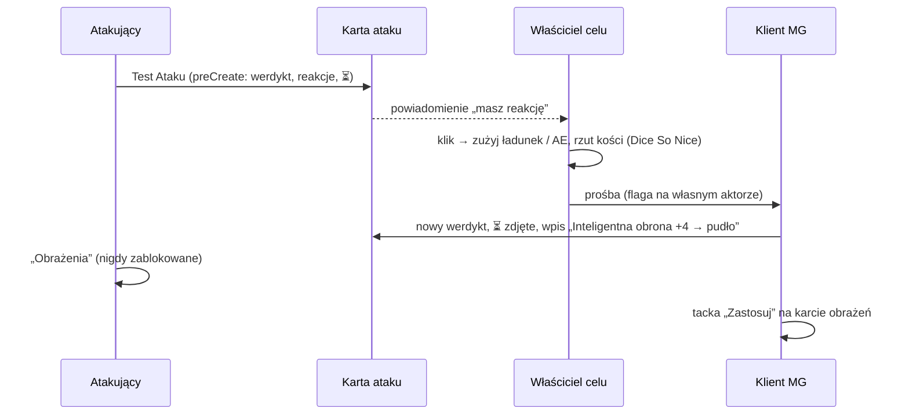

# PLAN — Trudność Trafienia wg NOE: silnik TT, jeden rozstrzygacz trafienia, okno „Reakcje celu”

> Status: **WDROŻONY** (2026-10-04) — E0–E6 ✅, paczki przebudowane; w świecie: `zdolnosci.resync()` (49 kopii),
> Pustak oznaczony (D16), Quench 759/759. Czeka: potwierdzenie autora systemu dla D15.
> Rozmiar: **L** (był M — reakcje obronne wymagają rozdzielenia rzutu ataku i obrażeń, §4.7).
> Wywołanie: rejestr pokrycia (PLAN_beta B5) — Goła klata i Tarcza wiary nie nakładają TT, moduł
> tylko wyszarza słabszą (`actors/class-rules.mjs`). Przegląd RAW pod ten plan znalazł ~20 źródeł TT,
> z których kod liczy 4, oraz auto-obrażenia, które odbierają graczom rzut i wykluczają reakcje RAW.
>
> **Część A** — TT postaci: jedna metoda + premie, liczone w danych pochodnych, z dymkiem.
> **Część B** — trafienie: jeden rozstrzygacz, atak ≠ obrażenia, okno „Reakcje celu” na karcie ataku.

## 1. RAW — pełny inwentarz (NOE, październik)

Podstawowa TT = 10 + mod. ZRC (s. 15, s. 53). Naturalna 20 zawsze trafia (Trafienie Krytyczne),
naturalna 1 nigdy (s. 16). **Reguła nadrzędna** (s. 59, Wieloklasowość): „Jeśli masz dostęp do kilku
sposobów obliczania TT, możesz korzystać tylko z jednego z nich” — przykład: Goła klata vs Tarcza wiary.

### 1.1 Metody — konkurują, wygrywa najwyższa (D1, D3)

| Metoda | Strona | Warunek | Wartość | Dziś w kodzie |
|---|---|---|---|---|
| TT podstawowa („bez pancerza”) | s. 15, 53 | brak pancerza korpusu (ochraniacze dokładają swoje +1) | 10 + ZRC | natywne dnd5e |
| Pancerz | s. 113–114 | pancerz lekki / średni / ciężki | z tabeli; ZRC: lekki w całości, średni do limitu, ciężki wcale | natywne dnd5e |
| **Goła klata** (Brutal 1) | s. 67 | bez pancerza, hełmu i tarczy | 10 + ZRC + KON | ❌ tylko wyszarzenie |
| **Tarcza wiary** (Kaznodzieja Nowej Ery) | s. 75 | bez pancerza | 10 + ZRC + CHA | ❌ tylko wyszarzenie |

### 1.2 Limit

| Źródło | Strona | Warunek | Skutek | Dziś |
|---|---|---|---|---|
| **Trening w zbroi** (Żołnierz) | s. 89 | noszony pancerz | limit ZRC z pancerza +1; średni 2 → 3, kiepska zbroja 1 → 2, **ciężki 0 → 1** (D5); nigdy nie obniża TT | ❌ |

### 1.3 Premie stałe — sumują się z wygraną metodą (D1)

| Źródło | Strona | Warunek | Wartość | Dziś w kodzie |
|---|---|---|---|---|
| **Obłęd Berserkera** (Berserk) | s. 67 | w Berserku; bez pancerza, hełmu i tarczy | + SIŁ | 🟡 AE liczony **raz, przy włączeniu** (Z2) |
| **Obsługa pancerza** (Wyjadacz: Twardziel, Zwiadowca) | s. 86, 98 | noszony pancerz | +2 (raz, nawet z dwóch klas — P5) | ❌ |
| **Kuloodporność** (Sztuczka) | s. 104 | bez pancerza, hełmu i tarczy | + PB | ❌ |
| Ochraniacze rąk / nóg | s. 113, 115 | założone; nie z ciężkim pancerzem | +1 każde; **w warunkach zdolności to pancerz** (D4) | ✅ AE przedmiotu (`config/armor-data.mjs`); konflikt z ciężkim pilnuje lalka |
| Zasłona (Samuraj) | s. 107 | finezyjna broń biała tnąca w ręce | +1 | ✅ AE synchronizowany (`actors/samuraj.mjs`) — do silnika (P2) |
| **Tańczący z siekierkami** (Siekierezada) | s. 107 | dwie siekierki w rękach (P1) | +1 | ❌ `manual` |
| **Roszada** (Szachista) | s. 107 | akcja Unikanie, do początku następnej tury | +3 | ❌ |
| Wytrzymałość pancerzy (opcjonalne) | s. 115 | Trafienie Krytyczne w pancerz | −1 za uszkodzenie | ✅ `production/naprawa.mjs` (ustawienie świata) |
| Tarcza | s. 115 | — | **0** — w NOE tarcza nie daje TT, tylko akcje (Cios, Osłona, Parowanie) | ✅ katalog `ac: 0` |
| Hełm | s. 114 | — | 0 (daje Krytyczną ochronę, §1.4) | ✅ |

### 1.4 Reakcje — po trafieniu, przed obrażeniami (Część B)

| Reakcja | Strona | Wyzwalacz | Premia | Zasięg w czasie | Koszt |
|---|---|---|---|---|---|
| **Inteligentna obrona** (Spec 1) | s. 78 | trafienie atakiem | + INT | do początku Twojej następnej tury | 1 użycie (mod. INT / Krótki odp.) |
| **Koci odskok** (Złodziej 9, Dziewięć żyć) | s. 93 | Reakcja | + wynik Kociej kości | do początku Twojej następnej tury | 1 Kocia kość |
| **Bullet time** (Neo) | s. 105 | trafienie | +5 | ten atak | — |
| **Parowanie** (Mistrz walki wręcz) | s. 104 | atak wręcz | +1k4 | ten atak | — |
| **Parowanie tarczą** | s. 115 | trafienie atakiem wręcz | +5 | ataki **tego przeciwnika** do początku Twojej następnej tury | tarcza w ręce, biegłość, SIŁ 13+ |
| **Unik łowcy** (Mutant na śniadanie) | s. 98 | trafienie przez mutanta lub potwora | + PB | ten atak | — |
| **Empiryk** (Zabójca maszyn) | s. 101 | trafienie przez maszynę | + PB | ten atak | — |
| **Krytyczna ochrona** (Hełm) | s. 115 | Trafienie Krytyczne | zwykłe obrażenia zamiast krytycznych | ten atak | hełm niszczeje |
| Parowanie (Gladiator, Bestiariusz) | s. 222 | atak wręcz | +3 | ten atak | — |

### 1.5 Osłona — per atak (s. 27–28)

Połowiczna +2, trzy czwarte +5, całkowita wyklucza atak bezpośredni; przy kilku źródłach liczy się
najwyższa. Rozstrzygana w oknie ataku (`combat/cover.mjs`) — dziś tylko dla ataków dystansowych (Z7).

### 1.6 Poza tym planem

TT pojazdów, wierzchowców i towarzyszy oraz modyfikatory po stronie atakującego — lista w §8.

## 2. Rozstrzygnięcia

### 2.1 Decyzje MG (2026-10-03)

Kategoria wg `scripts/wkk/README.md`: **NOE** = dosłowna lektura, **RAI** = zamysł autora systemu
(drzewo NOE, komentarz w kodzie, wiersz w tabeli RAI, bez przełącznika), **WKK** = reguła stołu
(`scripts/wkk/`, przełącznik Kobaltu, wariant RAW obok).

| # | Pytanie | Rozstrzygnięcie | Kat. |
|---|---|---|---|
| D1 | Jak łączą się zdolności TT bez pancerza? | **Metody konkurują, premie się sumują.** Metody: 10 + ZRC, pancerz, Goła klata, Tarcza wiary (10 + ZRC + CHA). „Podobne” z klauzul Gołej klaty i Tarczy wiary = inne **metody**. Obłęd, Kuloodporność i reszta §1.3 stoją obok każdej wygranej metody. | RAI |
| D2 | Obłęd Berserkera a Goła klata | Kumulują się (wynika z D1). | RAI |
| D3 | Kto wybiera metodę? | Zawsze najwyższa, **bez przypinania**. Furtka = „Stała” / „Własna formuła” w oknie TT (D6). | NOE |
| D4 | Co to „pancerz” w warunkach zdolności? | **Pancerz lekki, średni, ciężki i ochraniacze rąk / nóg.** Autor systemu (Nicram, 2026-10-03): „Nałokietniki i nagolenniki są pancerzem, ponieważ dają premie do TT i są w tabeli Pancerze. Goła klata zaś bezpośrednio zakazuje Hełmu, bo ma go w opisie.” Ochraniacze gaszą więc Gołą klatę, Tarczę wiary, Obłęd i Kuloodporność i włączają Obsługę pancerza; metoda podstawowa (10 + ZRC) zostaje, ochraniacze dokładają do niej swoje +1. Hełm i tarcza wyłączają tylko tam, gdzie są wymienione z nazwy (Goła klata, Obłęd, Kuloodporność) — Tarcza wiary działa w hełmie i z tarczą. *(Pierwotnie: ochraniacze niczego nie wyłączają — zmienione po rozstrzygnięciu autora.)* | RAI |
| D5 | Trening w zbroi w ciężkim pancerzu | Tak: limit 0 → 1 (potwierdzone przez MG 2026-10-03). Same ochraniacze nie mają limitu ZRC — Trening nic nie zmienia. | NOE |
| D6 | Natywne okno TT dnd5e | „Domyślna” → **„NOE (automatycznie)”**; metody 5e (Mag, Smocza, Mnich, Barbarzyńca, Bard) ukryte; zostają Stała, Naturalna, Własna formuła jako furtka MG. | — |
| D7 | Kogo liczy silnik TT? | Aktorzy `character`. BN: TT ze statblocku / natywnego dnd5e. Okno „Reakcje celu” działa dla każdego celu (D13). | — |
| D8 | Auto-obrażenia (Z3) | **Usunąć.** Rzut ataku i rzut obrażeń rozdzielone globalnie — obrażenia zawsze rzuca atakujący przyciskiem, jak w natywnej karcie dnd5e. Nakładanie **ręczne**: natywna tacka dnd5e na karcie obrażeń. | — |
| D9 | Gdzie gracz widzi swoje reakcje? | Sekcja **„Reakcje celu”** na karcie ataku: widzą wszyscy, przyciski aktywne dla właściciela celu i MG; właściciel celu dostaje powiadomienie. | — |
| D10 | Czy coś czeka na decyzję celu? | **Nic nie blokujemy** — w żadną stronę (BG i BN-cele tak samo). Przycisk „Obrażenia” zawsze aktywny, z plakietką ⏳, gdy reakcja może jeszcze zmienić wynik. MG pilnuje kolejności — także przy celach zadeklarowanych słownie (MG ustawia cel na karcie, §4.8.6). | — |
| D11 | Stan przycisków reakcji | Reakcja **na ten atak** wyszarzona, gdy nawet najwyższy wynik nie zmieni trafienia w pudło (w tym naturalna 20) albo brak ładunków — z powodem w podpowiedzi. Reakcja **trwała** (do początku tury: Inteligentna obrona, Koci odskok, Parowanie tarczą) aktywna zawsze, gdy są ładunki; bez opisu skutku. | — |
| D12 | Krytyczna ochrona hełmu | W tym planie, w tym samym oknie. Hełm zdejmowany z głowy automatycznie. | NOE |
| D12a | Co zostaje po hełmie? | Z Kobaltem: **„Dziurawy hełm”** — śmieć za 2 gb w plecaku. Bez Kobaltu: hełm usunięty (RAW). | WKK |
| D13 | Reakcje BN-celów | Reakcje TT z Bestiariusza automatycznie (Gladiator: Parowanie +3); każda inna cecha BN z Reakcją — przypomnienie dla MG bez automatyki; skrypt dry-run proponuje oznaczenie cech ręcznych BN (Pustak: Ofiara). | NOE |
| D14 | Klasyfikacja D1/D2 | RAI — jeden wiersz w tabeli RAI `scripts/wkk/README.md`. | — |
| D15 | Krytyk, który nie zadał obrażeń (próg obrażeń, niewrażliwość, mnożnik 0) — Stopień Zranienia? (2026-10-04) | **Nie** — „jeśli nie zadano obrażeń, nie ma czego zranić”. Interpretacja MG, **czeka na potwierdzenie autora systemu**; RAW wiąże Stopień z samym krytykiem (s. 32). | do potwierdzenia |
| D16 | `oznaczReakcjeBN` — kogo oznaczyć? (2026-10-04) | Tylko Pustaka („Ofiara” — Reakcja na atak na niego). Wilhelm Yarborough („Zasłona Własnym Ciałem”) — nie: jego Reakcja dotyczy sojusznika obok, a przypomnienie w oknie pojawia się, gdy celem jest on sam. | — |

### 2.2 Ustalone w projekcie (jedno sensowne wyjście, bez osobnego pytania)

- **P1** Tańczący z siekierkami = w obu rękach (lalka, `heldItems`) przedmiot z katalogu `siekierka`.
  „Walczysz” czytamy jak Zasłonę: dzierżysz, nie „zaatakowałeś w tej turze” (moduł nie liczy akcji).
- **P2** Zasłona Samuraja przechodzi z AE do silnika (pochodna, zero zapisów do bazy przy każdej
  zmianie broni w ręku). Haki +1 do Testu Ataku i obrażeń zostają w `samuraj.mjs`.
- **P3** Ochraniacze zostają Efektami Aktywnymi przedmiotu (ich +1 do TT) — to dane przedmiotu, dnd5e sam je wygasza
  po zdjęciu, a dymek pokazuje je natywną ścieżką.
- **P4** Roszada czyta stan **Unikanie** (`dodging`). Stan dostaje czas trwania RAW (s. 30: do początku
  następnej tury) i znika sam; Roszada gaśnie przy Obezwładnieniu i Szybkości 0 (warunki Unikania).
- **P5** Obsługa pancerza z dwóch klas liczy się raz (jak Drugi atak, s. 59).
- **P6** Parowanie tarczą wymaga tarczy **w ręce** (lalka), biegłości w tarczach i SIŁ ≥ wymaganej
  (s. 115: „wymagana jest biegłość, odpowiednia siła i wolna ręka”).
- **P7** Unik łowcy / Empiryk rozpoznają atakującego po `details.type.value` (`config/creature-types.mjs`:
  `mutant`, `potwor`, `maszyna`). Typ nieznany → przycisk aktywny, z dopiskiem „typ atakującego nieznany”.
- **P8** Ekonomii Reakcji nie liczymy (doktryna): karta pokazuje „Reakcja w tej rundzie już użyta: …”,
  gdy wie to z własnych kart, ale niczego nie wyszarza z tego powodu.
- **P9** Krytyczna ochrona zamienia krytyk na zwykłe trafienie, więc nie wyzwala też skutków krytyka:
  Stopnia Zranienia z krytyka (s. 32) i wytrzymałości pancerza (s. 115) — oba czytają krytyk z rzutu
  obrażeń, który będzie zwykły.
- **P10** Wyszarzanie zdolności na karcie (`class-rules.mjs`) dotyczy tylko metody, która **przegrywa
  niezależnie od ekwipunku** (Goła klata vs Tarcza wiary przy tych samych cechach). Chwilowa
  nieaktywność (hełm, pancerz, brak Berserka) jest w dymku, nie w wyszarzeniu.

## 3. Stan kodu — znaleziska

| # | Znalezisko | Gdzie | Naprawa |
|---|---|---|---|
| Z1 | `isUnarmoured()` i `_berserkAcBonus()` nie widzą hełmu (hełm to `trinket`) | `actors/class-rules.mjs`, `actors/class-state.mjs` | E1 — silnik czyta lalkę |
| Z2 | Obłęd liczony raz, przy włączeniu Berserka — pancerz założony w trakcie nie gasi premii, zdjęty nie włącza | `actors/class-state.mjs` | E1 |
| Z3 | **Auto-obrażenia** — pojedynczy strzał z broni z kalibrem, w walce, z celem: klient strzelającego sam rzuca obrażenia i woła `applyDamage`. Gracz nie rzuca (Dice So Nice pokazuje kości bez klika), reakcje RAW niemożliwe. Nasza implementacja (maj 2026), nie dnd5e | `weapons/ammo.mjs` `_onPostRollAttackAutoApply` | E2 (D8) |
| Z4 | Wszystkie „czy trafił” czytają gołe `ac.value` — ignorują Osłonę z okna ataku; `ammo.mjs` i `dozownik.mjs` ignorują też naturalną 1/20 | `ammo.mjs`, `dozownik.mjs`, `production/olejek.mjs`, `weapons/sounds.mjs`, `magazine.mjs` `_isAttackHit` | E2 — jeden rozstrzygacz |
| Z5 | Własny przycisk „Obrażenia” nie podwaja kości przy krytyku i omija `dnd5e.preRollDamage` (okno obrażeń, pole „Redukcja osłony”, premie z haków); sam nakłada obrażenia z klienta klikającego | `weapons/ammo.mjs` `_injectDamageButton` | E2 — natywny rzut |
| Z6 | Dozownik zużywa dawkę i nakłada truciznę już przy rzucie ataku | `weapons/dozownik.mjs` | E2 — przy rzucie obrażeń |
| Z7 | Osłona pytana tylko przy atakach dystansowych; RAW s. 27 dotyczy każdego ataku | `combat/cover.mjs` `_isRangedAttackActivity` | poza planem → M1 |
| Z8 | Stan Unikanie nie ma czasu trwania — wisi do ręcznego zdjęcia | `config/conditions.mjs` | E1 (P4) |
| Z9 | Reakcje §1.4 nie mają kodu; Inteligentna obrona zużywa użycie i drukuje kartę bez skutku | `class-features-data.mjs`, `sztuczki-data.mjs` | E3 |
| Z10 | Nieaktualne teksty: `ARMOR_GLOBAL_MANUAL` („moduł nie zbija TT” — od E7 Produkcji zbija), PLAN_beta §4 (wytrzymałość „po becie, ręcznie”), komentarz `class-rules.mjs` (Obłęd w grupie `unarmoredAc`) | jw. | E6 |

Stan świata (CDP, 2026-10-03): aktywni BG mają metodę „Domyślna” — silnik obejmie ich bez migracji;
karty z Roll20 mają „Stała” i zostaną nietknięte (furtka). Na kartach aktywnych BG: Inteligentna obrona
(4 użycia), Unik łowcy, Zasłona; Tarcza wiary w zasięgu awansu Kaznodziei.

## 4. Projekt

### 4.1 Część A — silnik TT (`config/tt-rules.mjs`, czysty, bez Foundry)

**Wejście** — migawka budowana w `actors/tt.mjs`:

```js
{
  mods: { str, dex, con, int, wis, cha }, prof,
  armor: null | { name, type: "light"|"medium"|"heavy", value, lost, dexCap: number|null },
  guards: bool,                                 // ochraniacze — pancerz w warunkach zdolności (D4)
  helmet: bool, shieldInHand: bool,
  owned: Set<abilityKey>,                       // §4.11
  states: { berserk, dodging, incapacitated, speed0 },
  held: { zaslona: bool, twoHatchets: bool }
}
```

`armor.value` jest już po wytrzymałości (`naprawa.mjs` zbija je w danych pochodnych przedmiotu,
przed aktorem); `lost` służy tylko dymkowi.

**Tabele** — nowe źródło = nowy wiersz, nie nowy `if`. Każdy wiersz: `id`, `label`, `page`,
`kind` (`method` / `cap` / `bonus`), `when(s)` → `true` albo powód odrzucenia (string), `value(s)`.

- `TT_METHODS`: bez pancerza (tylko gdy `!armor`), pancerz (tylko gdy `armor`), Goła klata,
  Tarcza wiary. Część ZRC pancerza: lekki → ZRC; średni → `min(ZRC, limit + trening)`; ciężki →
  `trening ? clamp(ZRC, 0, 1) : 0` (Trening nigdy nie dokłada kary za ujemną ZRC).
- `TT_BONUSES`: Obłęd (`max(0, SIŁ)`), Obsługa pancerza, Kuloodporność, Zasłona, Tańczący
  z siekierkami, Roszada.

**Algorytm:** policz wszystkie metody dozwolone przez stan ekwipunku; zwycięzca = najwyższa
(remis → kolejność tabeli: pancerz, bez pancerza, Goła klata, Tarcza wiary); dodaj premie, których
`when` przechodzi. Odrzucone: metody przegrane („słabsza od X, s. 59”) i **posiadane** źródła,
których warunek nie przechodzi („nosisz hełm”, „nie jesteś w Berserku”). Nieposiadanych nie listujemy.

**Wyjście:**
`{ method: {id, label, value, parts}, bonuses: [{id, label, value, page}], total, rejected: [{id, label, value?, reason}] }`.

### 4.2 Wpięcie w dane pochodne (`actors/tt.mjs`)

Owinięcie `prepareDerivedData` aktora (wzorzec `armor-rules.mjs`, DEV_GUIDE §10c.3). Dla
`type === "character"` i `ac.calc === "default"`, po natywnym `prepareArmorClass`:

```
ac.neuroshima = computeTT(snapshot(actor))
ac.base  = ac.neuroshima.method.value
ac.value = max(ac.min, ac.neuroshima.total + ac.shield + ac.bonus + ac.cover)
```

`ac.bonus` niesie już Efekty Aktywne (ochraniacze, Inteligentna obrona, Koci odskok) — nie
dublujemy ich w silniku. `ac.shield` szanuje dane przedmiotu (katalog: 0; tarcza z homebrew
z wartością zadziała i pokaże się w dymku). Inna metoda niż „default” → silnik nie rusza niczego.

### 4.3 Dymek

Owinięcie `Actor5e#_prepareArmorClassAttribution` (z fallbackiem do oryginału): gdy jest
`ac.neuroshima`, rysujemy własną tabelę w klasach natywnego `property-attribution` (wygląd jak
dnd5e) z sekcją „nie liczy się” (przekreślone, powód w tej samej linii):

```
 15  Goła klata (10 + ZRC 2 + KON 3)
 +3  Obłęd Berserkera
 +1  Ochraniacze rąk                     ← natywne `_prepareActiveEffectAttributions`
 19  Razem
 ─ nie liczy się ─
 16  Tarcza wiary — słabsza od Gołej klaty (s. 59)
 +2  Kuloodporność — nosisz hełm
```

Pancerz pokazuje uszkodzenie: „Kurtka ćwiekowana 11 + ZRC 3 (−1 uszkodzenie)”. Metoda „Stała” /
„Własna formuła”: natywny dymek + linia „TT ustawiona ręcznie — reguły NOE wyłączone”.

### 4.4 Okno konfiguracji TT (D6)

`init`: `CONFIG.DND5E.armorClasses.default.label = "NOE (automatycznie)"`; usunąć `mage`, `draconic`,
`unarmoredMonk`, `unarmoredBarb`, `unarmoredBard`. Aktor z usuniętą metodą spada w dnd5e na „Stała”
z bieżącą wartością (`prepareArmorClass`, gałąź migracji) — E1 zaczyna od raportu, kto ich używa.

### 4.5 Efekty chwilowe i wygasanie

| Efekt | Kształt | Skąd |
|---|---|---|
| Inteligentna obrona | AE `ac.bonus` + INT, flaga `tt.source` | okno reakcji, hotbar, karta |
| Koci odskok | AE `ac.bonus` + wynik kości | jw. |
| Parowanie tarczą | AE-znacznik bez zmian, flaga `ttVsAttacker: {attackerUuid, bonus: 5, melee: true}` | okno reakcji |
| Unikanie | stan `dodging` | HUD żetonu (bez zmian) |

Wszystkie: `duration: { value: 1, units: "rounds", expiry: "turnStart" }` — rdzeń v14 oznacza
wygaśnięcie na początku tury **właściciela** efektu (`ActiveEffect#isExpiryEvent`). Kasowanie jest
nasze (DEV_GUIDE §10e.2): jeden handler `updateCombat` u aktywnego MG, wzorzec `podpalenie.mjs`
/ `class-state.mjs`; do tego `deleteCombat` i odpoczynek czyszczą resztki. Poza walką efekt wisi
do końca walki, odpoczynku albo ręcznego zdjęcia. Użycie Inteligentnej obrony / Kociego odskoku
z hotbara lub karty idzie przez `dnd5e.preUseActivity` → ta sama funkcja co z okna (wzorzec
przekierowania Berserka w `class-state.mjs`).

### 4.6 Część B — jeden rozstrzygacz trafienia

Czyste (`config/defense-rules.mjs`):

```js
resolveHit({ natural, total, tt, cover, bonuses }) → { verdict: "pudło"|"trafienie"|"krytyk", need }
```

Naturalna 20 → krytyk (zawsze trafia), naturalna 1 → pudło, inaczej `total ≥ tt + cover + Σbonuses`.
`need` = ile brakuje do pudła — z tego `reactionState()` liczy, czy reakcja „ma szansę” (D11).

Glue (`combat/trafienie.mjs`): `ttAgainst(targetActor, { attackerActor, melee })` = `ac.value` +
znaczniki `ttVsAttacker` pasujące do atakującego. Osłona z opcji rzutu (`options.neuroCover`,
`cover.mjs`). **Każde** miejsce, które pyta „czy trafił”, przechodzi na rozstrzygacz albo na werdykt
ostemplowany na karcie (Z4): `dozownik.mjs`, `olejek.mjs`, `sounds.mjs` (pudło wręcz),
`magazine.mjs` `_isAttackHit` (VFX smugacza).

Werdykt stemplujemy na karcie ataku w `preCreateChatMessage` u atakującego (ten sam wzorzec, którym
`magazine.mjs` stempluje `shotCaliber`) i poprawiamy natywną tackę celów dnd5e (ikony trafił/pudło),
jak `cover.mjs` poprawia dziś wyświetlaną TT. Widoczność TT BN dla graczy wg natywnego ustawienia
dnd5e `attackRollVisibility`.

### 4.7 Rozdzielenie ataku i obrażeń (D8)

- Usunąć `_onPostRollAttackAutoApply` (`ammo.mjs`).
- Pojedynczy strzał wraca na **natywny** przycisk i rzut obrażeń dnd5e. Własny przycisk z
  `_injectDamageButton` znika; kości naboju wstrzykujemy w momencie rzutu tym samym budowniczym,
  którego używają serie (`fire-modes.mjs`, `_buildNoModifierDamageRoll` + `effectiveDamageFor`):
  bez modyfikatora cechy, z właściwościami naboju (`rozrywajaca`, `hollowpoint`). Kaliber z
  `shotCaliber` karty-źródła, inaczej głowa magazynka. Zyskujemy: krytyk podwaja kości, okno obrażeń
  z „Redukcją osłony”, haki `preRollDamage`, Dice So Nice z klika gracza.
- Nakładanie: natywna tacka dnd5e na karcie obrażeń (MG; dnd5e 5.3 pokazuje ją tylko MG), już
  spięta z `weapons/damage-reduction.mjs`. Reakcje po poznaniu obrażeń (Odskok Złodzieja, Matrix,
  „Tylko draśnięcie” Cyngla) = mnożnik ½ na tacce.
- Dźwięk trafienia broni palnej → `dnd5e.rollDamage` (tak jak dziś biała). Smugacz zostaje przy
  rzucie ataku z werdyktem sprzed reakcji — kosmetyka, świadomie.
- Dozownik i olejek: zużycie i karta trucizny przy rzucie obrażeń dla celów z werdyktem trafienia;
  karta trucizny jako rzut obrażeń (`flags.dnd5e.roll.type = "damage"`) → tacka zamiast własnego
  `applyDamage`.

### 4.8 Okno „Reakcje celu” (D9–D11)

#### 4.8.1 Katalog (`DEFENSE_REACTIONS`, czysty)

Wiersz: `id`, `label`, `page`, `owner(s)` (posiada?), `applies(ctx)` (wręcz? typ atakującego?
krytyk?), `bonus` (liczba albo kość), `scope` (`attack` / `turn` / `attacker`), `charges(s)`,
`effect` (`tt` / `critDowngrade`). Pozycje: §1.4 + wpisy Bestiariusza (§4.10).

#### 4.8.2 Stany przycisku

| Stan | Kiedy |
|---|---|
| aktywny | reakcja pasuje, są ładunki, i: `scope: attack` → maks. premia ≥ `need` i nie naturalna 20; `scope: turn/attacker` → zawsze (D11) |
| wyszarzony + powód | „za wysoki rzut (21 vs maks. 19)”, „naturalna 20”, „brak użyć”, „atak nie wręcz”, „tarcza nie w ręce” |
| ukryty | postać reakcji nie posiada |

Plus przycisk **„Bez reakcji”** (zdejmuje ⏳). Brak aktywnego MG → przyciski wyszarzone: „potrzebny MG”.

#### 4.8.3 Przepływ



Klik MG działa bez przekaźnika (MG pisze wszędzie).

#### 4.8.4 Dane na karcie ataku

```js
flags[MODULE_ID].obrona = {
  v: 1, attackerUuid, melee, natural, total, krytyk,
  targets: { [tokenUuid]: {
    actorUuid, name, tt, cover,
    used: [{ id, label, bonus, roll, by }],
    critDowngraded, verdict, decided
  } }
}
```

Kluczem jest UUID żetonu, a w środku `actor.uuid` — aktorzy syntetyczni (DEV_GUIDE §10e.3).
Pierwszy zapis robi autor karty w `preCreateChatMessage`; **każdy kolejny zapis robi tylko MG**
(jedyny pisarz po utworzeniu → brak wyścigów). Sekcja renderowana per widz w `renderChatMessageHTML`.

#### 4.8.5 Przekaźnik

Idiom modułu (`items/kolczatka.mjs`, lalka): gracz pisze `flags.<mod>.obronaProsba =
{ messageId, tokenUuid, reactionId, bonus, nonce }` na **własnym** aktorze; `updateActor` u aktywnego
MG sprawdza, czy reakcja nadal pasuje, aktualizuje kartę i czyści prośbę. Reakcje trwałe: klient
gracza sam zużywa ładunek i tworzy AE (jest właścicielem), MG przelicza TT już z efektem. Kości
losowe (1k4, Kocia kość) rzuca gracz u siebie — Dice So Nice, wynik w prośbie (gracze nie oszukują).
Kliknięcia z kart: rejestracja w fazie capture na `document` (DEV_GUIDE, „Chat log custom buttons”).

#### 4.8.6 Cel zadeklarowany słownie

Karta bez celów → przycisk MG **„Ustaw cel”**: bierze bieżące cele MG (albo zaznaczone żetony),
zapisuje `obrona.targets`, liczy werdykt i reakcje. Ten sam przycisk podmienia źle zaznaczony cel.

#### 4.8.7 Przerzut

Fuks na Teście Ataku (`combat/rerolls.mjs`, hak `neuroshima.rerolled`) → MG przenosi `obrona` na
kartę przerzutu i przelicza z nowym wynikiem; stara karta dostaje „zastąpione przerzutem”. Amen
nie jest zautomatyzowany — MG klika „Ustaw cel” po zmianie wyniku.

#### 4.8.8 Plakietka ⏳

Przy przycisku „Obrażenia” atakującego: „⏳ Raynald może zareagować”, dopóki któryś cel ma
niezdecydowaną, **aktywną** reakcję na ten atak. Tylko informacja (D10).

### 4.9 Krytyczna ochrona i Dziurawy hełm (D12)

Przycisk pojawia się przy werdykcie „krytyk”, gdy cel ma hełm na głowie (lalka: rodzina `helmet`,
aktywny). Klik: `critDowngraded = true`, werdykt „trafienie”; `dnd5e.preRollDamage` czyta kartę-źródło
i rzuca bez krytyka (gdy cel jest jeden — w NOE Test Ataku ma jeden cel; przy kilku celach rzut zostaje
krytyczny, a karta mówi MG, komu nałożyć zwykłe obrażenia). Hełm: Kobalt → `Dziurawy hełm`
(`loot`/`junk`, 2 gb, 3 kg — `scripts/wkk/config/`) do plecaka i usunięcie hełmu; RAW → usunięcie.
Zdejmuje go lalka (usunięty przedmiot zwalnia slot). P9: brak krytyka = brak Stopnia Zranienia
z krytyka i uszkodzenia pancerza — do potwierdzenia testem w E4.

### 4.10 BN-cele (D13)

- **Bestiariusz:** nowy rodzaj `AUTOMATION` w `dev/bestiary/gen_bestiary.py`: `{ kind: "ttReaction",
  bonus, melee, scope }` → Gladiator: Parowanie +3 przeciw jednemu atakowi wręcz. Przebudowa paczki.
- **Przypomnienia:** inne cechy celu z sekcji REAKCJA (flaga Bestiariusza) albo z aktywacją `reaction`
  → wiersz bez przycisku, nazwa + opis w podpowiedzi (Cyngiel: Tylko draśnięcie; Mesmeryta:
  Iluzoryczny cel; Kapo: Ofiara).
- **Skrypt** `api.migration.oznaczReakcjeBN()` — dry-run: cechy ręcznych BN z „Reakcj” w opisie
  i bez aktywacji → propozycja `activation.type = "reaction"`; `{ commit: true }` na życzenie MG.

### 4.11 Kto ma zdolność

Wszystko przez most `hasAbility()` (`actors/abilities.mjs`) — rozpoznaje przedmioty z paczek
i ręcznie wpisane featy z Roll20 po aliasach (Samuraj Victora to goły feat). Nowe `ABILITY_KEYS`:
`golaKlata`, `tarczaWiary`, `berserk`, `obslugaPancerza`, `treningWZbroi`, `kuloodpornosc`,
`szachista`, `neo`, `mistrzWalkiWrecz`, `inteligentnaObrona`, `mutantNaSniadanie`, `empiryk`,
`dziewiecZyc` (istnieją: `samuraj`, `siekierezada`). Deklaracje w danych: `legacyAbilityKey` —
**w generatorze** `dev/classes/gen_features.py` (`class-features-data.mjs` jest generowany),
`legacyAbilityKeys` — w `sztuczki-data.mjs`. Silnik czysty dostaje gotowy `Set`.

## 5. Etapy

Kolejność = zależności. Warstwy testów wg `TESTING.md` §3; aktorzy testowi wyłącznie prawdziwi
(`scratchActor`), dokumenty tymczasowe w dnd5e 5.3 nie przechodzą `prepareData`.

### E0 — Czyste zasady i własność (S–M)

- `config/tt-rules.mjs` (`TT_METHODS`, `TT_BONUSES`, `computeTT`), `config/defense-rules.mjs`
  (`DEFENSE_REACTIONS`, `resolveHit`, `reactionState`); `ABILITY_KEYS` + aliasy (§4.11).
- Testy — warstwa 1: unikalne `id`, każda pozycja ma `page`, każdy klucz zdolności rozwiązuje się
  w `ABILITY_DEFINITIONS`. Warstwa 4: każda pozycja §1.1–1.3; D1 (Tarcza wiary + Obłęd +
  Kuloodporność); hełm gasi Gołą klatę, nie Tarczę wiary; ochraniacze gaszą jak pancerz i włączają Obsługę; Trening: średni
  2 → 3, ciężki 0 → 1, ciężki z ZRC −1 = 0; Obsługa z dwóch klas = +2; remisy; `resolveHit`
  (naturalna 1/20, osłona, premie); `reactionState` — każdy powód wyszarzenia.
- **Gotowe gdy:** `npm test` i paczka `tt-zasady` zielone.

### E1 — TT na karcie (M)

- `actors/tt.mjs`: migawka (lalka: pancerz, hełm, tarcza w ręce, broń w rękach; stany; Berserk),
  owinięcie danych pochodnych, `ac.neuroshima`, dymek, okno TT (§4.4, najpierw raport metod).
- Obłęd wychodzi z AE Berserka (`STATE_CONFIG` i `_berserkAcBonus` — karta Berserka opisuje Obłęd
  z silnika); Zasłona wychodzi z AE Samuraja; Unikanie z czasem trwania; Roszada; wyszarzanie
  `class-rules.mjs` z silnika (P10).
- Migracja w tym samym wydaniu (§6).
- Testy warstwy 5: Brutal bez niczego / w hełmie / w Berserku / w Berserku w pancerzu; Brutal-Kaznodzieja;
  Twardziel z Obsługą w pancerzu i bez; Żołnierz z Treningiem w średnim i ciężkim; Kuloodporność
  z hełmem i bez; pancerz uszkodzony; Samuraj z kataną w ręce i w pochwie; dwie siekierki; Unikanie
  + Szachista; metoda „Stała” nietknięta. Aktualizacja `sztuczki-combat.test.mjs` (Samuraj czytał
  `ac.bonus`).
- **Gotowe gdy:** TT aktywnych BG bez zmian tam, gdzie nie mają źródeł z §1; Zasłona widoczna
  w dymku Victora; zero efektów `neuroSamurajTT00` i zero zmian `ac.bonus` w Berserkach.

### E2 — Jeden rozstrzygacz, atak ≠ obrażenia (M)

- `combat/trafienie.mjs`: `ttAgainst`, stempel werdyktu, poprawka natywnej tacki celów.
- §4.7 w całości; przejście Z4 na rozstrzygacz.
- Testy: warstwa 4 — budowniczy obrażeń pojedynczego strzału (kości naboju, `fixedDamage`, brak
  modyfikatora, właściwości naboju). Na żywo: strzał P w walce z celem → zero obrażeń bez klika;
  „Obrażenia” → Dice So Nice, krytyk podwaja, „Redukcja osłony” działa, tacka u MG; osłona ½
  zmienia werdykt dozownika.
- **Gotowe gdy:** w kodzie nie ma `applyDamage` wołanego z rzutu ataku; `docs/` opisuje przepływ
  (gracz rzuca obrażenia, MG nakłada).

### E3 — Okno „Reakcje celu” dla BG (L)

- §4.8 w całości: sekcja, stany przycisków, przekaźnik, powiadomienie, ⏳, „Ustaw cel”, przerzut,
  hotbar/karta → AE, sprzątanie efektów (§4.5).
- Siedem reakcji BG z §1.4 (bez hełmu i Bestiariusza).
- Testy: warstwa 4 — walidacja prośby (stara karta, cudzy aktor, reakcja już niepasująca), przejścia
  stanów; warstwa 5 — AE z czasem trwania i sprzątanie (zaślepiony `game.combat`, TESTING §5).
  Na żywo (CDP): BN trafia Raynalda 17 vs 15 → Inteligentna obrona +4 → pudło, użycie zeszło,
  TT 19 do jego tury; Bullet time wyszarzony przy naturalnej 20; Unik łowcy u Alana aktywny na
  mutanta, wyszarzony na człowieka; Parowanie tarczą działa na drugi atak tego samego wroga.
- **Gotowe gdy:** każda reakcja z §1.4 przeszła na żywo, karta ataku poprawnie mówi „pudło po reakcji”.

### E4 — Krytyczna ochrona hełmu (S)

- §4.9; `Dziurawy hełm` w `scripts/wkk/config/` + wiersz w `scripts/wkk/README.md`.
- Testy: rzut obrażeń po zamianie nie jest krytyczny; brak Stopnia Zranienia i uszkodzenia pancerza;
  hełm zdjęty, z Kobaltem w plecaku leży Dziurawy hełm, bez Kobaltu — nic.

### E5 — BN-cele (S–M)

- §4.10: `ttReaction` w generatorze Bestiariusza, przypomnienia, skrypt dry-run.
- **Gotowe gdy:** Gladiator paruje z karty MG; Pustak ma przypomnienie „Ofiara” po skrypcie.

### E6 — Rejestry, dokumentacja, paczki (S)

- Rejestry pokrycia: Goła klata, Tarcza wiary, Obsługa pancerza, Trening w zbroi (część TT),
  Inteligentna obrona, Mutant na śniadanie (Unik łowcy), Empiryk, Dziewięć żyć (Koci odskok) — tabela
  `COVERAGE` w `gen_features.py`; Kuloodporność, Neo, Mistrz walki wręcz (Parowanie), Szachista,
  Siekierezada, Samuraj — `sztuczki-data.mjs`; teksty `manual` hełmu i tarczy w `armor-data.mjs`.
- Wiersz RAI (D1/D2) w `scripts/wkk/README.md`; Z10.
- `docs/` dla graczy: „Skąd moja TT” i „Reakcje obronne”; ARCHITECTURE (nowy przepływ ataku);
  IMPLEMENTATION (macierz, tabela plików); changelog.
- `npm run build:packs` przy zamkniętym Foundry (plakietki są w paczkach) + resync zdolności na kartach.

## 6. Migracje i porządki

| Co | Jak | Kiedy |
|---|---|---|
| Berserk: zmiana `ac.bonus` w aktywnych efektach | MG na `ready`, idempotentnie — usuń wpis z `system.changes` | E1 |
| Samuraj: efekt `neuroSamurajTT00` | MG na `ready` — skasuj; usuń kolejkę/debounce z `samuraj.mjs` | E1 |
| Metody 5e w `ac.calc` | raport (CDP/skrypt) przed usunięciem z `CONFIG` | E1 |
| Stan Unikanie bez czasu | stare efekty zostają do ręcznego zdjęcia (nie migrujemy) | E1 |
| Cechy reakcji ręcznych BN | `oznaczReakcjeBN()` dry-run → MG | E5 |

## 7. Ryzyka

- **Podwójne liczenie** w okresie przejścia (Obłęd, Zasłona) — migracja w tym samym wydaniu co silnik.
- **Kolejność danych pochodnych** — AE na `ac.bonus` są już nałożone, gdy liczymy; przedmioty
  (wytrzymałość) też. Kilka owinięć `prepareDerivedData` się kaskaduje; silnik nie zależy od kolejności
  względem `armor-rules.mjs` (ten rusza tylko Szybkość i tryby rzutów).
- **dnd5e 5.x** może zmienić `_prepareArmorClassAttribution` / `getTargetDescriptors` — owinięcia
  z fallbackiem i test kontraktu (warstwa 2), że dymek zawiera rozkład.
- **Jeden klik więcej na trafienie** (D8) — świadomie; gra w Foundry jeszcze nie ruszyła, więc nie
  ma nawyku do zmiany.
- **Kaliber przy rzucie obrażeń** — rzut z karty-źródła zna `shotCaliber`; rzut z arkusza broni
  bierze głowę magazynka (może być już inny nabój). Udokumentowane, nie naprawiane.
- **Przekaźnik wymaga aktywnego MG** — bez MG przyciski wyszarzone z powodem.
- **Walka zostawiona jako aktywna** przelicza rundy na sekundy i psuje wygasanie (DEV_GUIDE §10e.3).

## 8. Poza planem (świadomie)

| Pozycja | Gdzie |
|---|---|
| TT pojazdu i jadących: OC (s. 89), Grigorij, Slalom, Lepiej we mnie (s. 102), Osłona jadących (s. 266) | M4 Pojazdy |
| TT wierzchowca: Jeździec (s. 97), Kawalerzysta (s. 106) | M6 / M3 |
| TT towarzyszy „12 + PB” itp. | M3 — metoda „Naturalna” / „Własna formuła” (furtka D6) |
| Przycelowanie / Celuję w (s. 87, 106) — atakujący podnosi TT celu | osobno; `resolveHit` przyjmie premię celowania bez zmian kształtu |
| Unikanie: Utrudnienie dla atakujących | M1 „Domyślne Utrudnienie w dialogu ataku” |
| Osłona w zwarciu (Z7) | M1 |
| Emiter EMP ignoruje TT z pancerza maszyny | M3 |
| Stałe warunkowe TT BN (Taktyka Posterunku) | Bestiariusz |
| Reakcje po poznaniu obrażeń (Odskok, Matrix, Tylko draśnięcie) | tacka dnd5e ½ — bez kodu |

## 8a. Zmiany w trakcie wdrożenia (2026-10-03)

Co okazało się inne niż w projekcie — decyzje MG bez zmian, poza D4.

| # | Co | Projekt mówił | Jest |
|---|---|---|---|
| W1 | Wygasanie efektów „do początku Twojej następnej tury” (§4.5) | `rounds: 1`, rdzeń wygasza na początku tury właściciela | Rdzeń v14 wygasza `turnStart` na początku tury kombatanta z `start.combatant`, a to ten, czyja tura trwała **przy tworzeniu** (atakujący). `actors/tt.mjs` przestawia `start.combatant` na właściciela; czas w turach (`turns: 1`) — w rundach efekt właściciela działającego później w tej samej rundzie trwałby o obieg za długo |
| W2 | Kształt `obrona.targets` (§4.8.4) | obiekt kluczowany UUID-em żetonu | lista z `tokenUuid` w środku — kropka w kluczu flagi rozwija się w zagnieżdżenie (DEV_GUIDE §16) |
| W3 | Wykonawca reakcji (§4.8.5) | klient gracza zużywa ładunek i zakłada efekt, MG przelicza | wszystko wykonuje aktywny MG po sprawdzeniu prośby; gracz rzuca tylko swoje kości. Odrzucona prośba nie zostawia zużytego ładunku |
| W4 | Przerzut Fuksem (§4.8.7) | MG przenosi `obrona` na kartę przerzutu | karta przerzutu Testu Ataku niesie powiązania dnd5e i `rerollOf`, a werdykt stempluje autor przy tworzeniu (pierwszy zapis autora — reguła jednego pisarza zachowana) |
| W5 | Właściwości naboju w obrażeniach | — | filtr `isPhysical` budowniczego serii wycinał `rozrywajaca` / `hollowpoint` / `ppanc`; teraz przechodzą do tacki MG. Hollow-point pod osłoną widzi właściwości naboju i przeżywa okno obrażeń |
| W6 | Stopień Zranienia z krytyka (P9) | czyta krytyk z rzutu obrażeń | nie działał nigdy (`combat/zranienie.mjs` słuchał `dnd5e.rollDamage` w sygnaturze, której żadna wersja dnd5e nie miała). **Naprawione** na prośbę MG: Stopień przy **nakładaniu** obrażeń tacką (`dnd5e.applyDamage`), krytyk z żywego werdyktu karty ataku (`isCriticalHitOn`) — Krytyczna ochrona po rzucie obrażeń wygrywa; raz na kartę i cel; krytyk zbijający PW do 0 daje jeden Stopień („albo”, s. 32); krytyk bez obrażeń nie rani (D15). Ten sam odczyt: wytrzymałość pancerza, Próg awarii Bestiariusza (ten czytał nieistniejące `roll.critical`) |
| W7 | Reakcja BN „Ofiara” (D13) | Pustak | w Bestiariuszu to Gangus Kapo (cecha z sekcji Zdolności → `reaction: true` w generatorze); Pustak i Wilhelm Yarborough to ręczni BN-i świata — `oznaczReakcjeBN()` |
| W8 | Etykieta metody 10 + ZRC | „Bez pancerza” | „TT podstawowa” — po D4 postać w samych ochraniaczach ma ją jako metodę, a „bez pancerza” by kłamało |

## 9. Pliki

| Plik | Zmiana |
|---|---|
| `scripts/config/tt-rules.mjs` | **nowy** — silnik TT (czysty) |
| `scripts/config/defense-rules.mjs` | **nowy** — rozstrzygacz, katalog reakcji (czysty) |
| `scripts/actors/tt.mjs` | **nowy** — migawka, dane pochodne, dymek, okno TT, efekty chwilowe |
| `scripts/combat/trafienie.mjs` | **nowy** — `ttAgainst`, stempel werdyktu, tacka celów |
| `scripts/combat/obrona.mjs` | **nowy** — sekcja „Reakcje celu”, przekaźnik, „Ustaw cel”, ⏳ |
| `scripts/tests/tt.test.mjs`, `obrona.test.mjs` | **nowe** paczki Quench |
| `scripts/actors/class-state.mjs` | Obłęd poza AE Berserka |
| `scripts/actors/class-rules.mjs` | grupa `unarmoredAc` z silnika |
| `scripts/actors/samuraj.mjs` | bez AE Zasłony |
| `scripts/actors/abilities.mjs` | nowe `ABILITY_KEYS` |
| `scripts/config/conditions.mjs` | Unikanie z czasem trwania |
| `scripts/weapons/ammo.mjs` | bez auto-obrażeń i własnego przycisku |
| `scripts/weapons/fire-modes.mjs` | budowniczy obrażeń wspólny z pojedynczym strzałem |
| `scripts/weapons/dozownik.mjs`, `production/olejek.mjs` | przy rzucie obrażeń, przez tackę |
| `scripts/weapons/sounds.mjs`, `weapons/magazine.mjs` | rozstrzygacz / werdykt |
| `scripts/config/sztuczki-data.mjs`, `config/armor-data.mjs` | aliasy, rejestr, teksty |
| `dev/classes/gen_features.py` | `legacyAbilityKey`, `COVERAGE` |
| `dev/bestiary/gen_bestiary.py` | `ttReaction` (Gladiator) |
| `scripts/wkk/config/…`, `scripts/wkk/README.md` | Dziurawy hełm; wiersz RAI D1/D2 |
